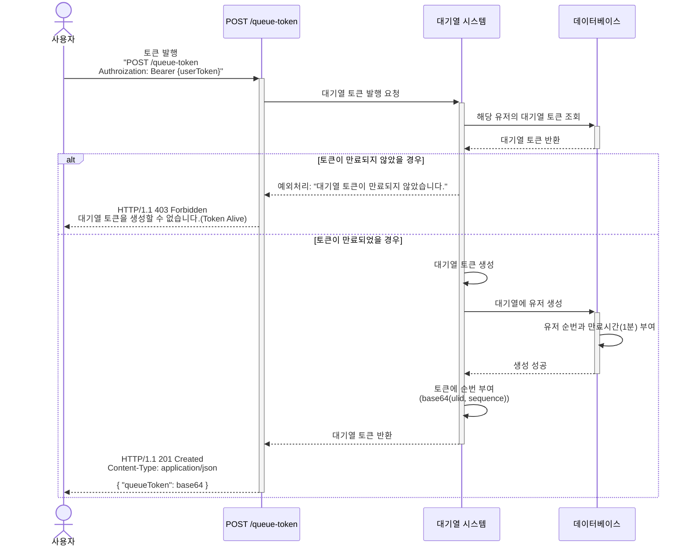
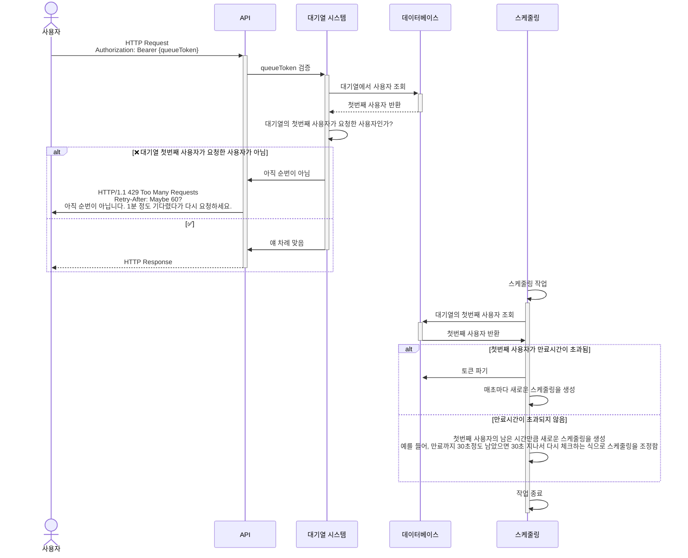

  

  항해 플러스 백엔드 5기 (19조).

## Projects

프로젝트 일정은 <a href="https://github.com/users/boy672820/projects/4">Github Projects</a>에서 확인하실 수 있습니다.

## Description

- `콘서트 예약 서비스`를 구현해 봅니다.
- 대기열 시스템을 구축하고, 예약 서비스는 작업가능한 유저만 수행할 수 있도록 해야합니다.
- 사용자는 좌석예약 시에 미리 충전한 잔액을 이용합니다.
- 좌석 예약 요청시에, 결제가 이루어지지 않더라도 일정 시간동안 다른 유저가 해당 좌석에 접근할 수 없도록 합니다.

## Requirements

- 아래 5가지 API 를 구현합니다.
  - 유저 토큰 발급 API
  - 예약 가능 날짜 / 좌석 API
  - 좌석 예약 요청 API
  - 잔액 충전 / 조회 API
  - 결제 API
- 각 기능 및 제약사항에 대해 단위 테스트를 반드시 하나 이상 작성하도록 합니다.
- 다수의 인스턴스로 어플리케이션이 동작하더라도 기능에 문제가 없도록 작성하도록 합니다.
- 동시성 이슈를 고려하여 구현합니다.
- 대기열 개념을 고려해 구현합니다.

# 요구사항 분석

## 목차

 - [예약가능 날짜 ∙ 좌석 조회 API](#예약가능-날짜--좌석-조회-api)
 - [잔액 충전 ∙ 조회 API](#잔액-충전--조회-api)
 - [대기열 토큰 발급 후 예약 API](#대기열-토큰-발급-후-예약-api)
 - [예약 결제 API](#예약-결제-api)
 - [대기열 토큰 발행 API](#대기열-토큰-발행-api)
 - [대기열 검증 API](#대기열-검증-api)

## 예약가능 날짜 ∙ 좌석 조회 API

- 예약가능한 날짜와 해당 날짜의 좌석을 조회하는 API 를 각각 작성합니다.
- 예약 가능한 날짜 목록을 조회할 수 있습니다.
- 날짜 정보를 입력받아 예약가능한 좌석정보를 조회할 수 있습니다.

> 좌석 정보는 1 ~ 50 까지의 좌석번호로 관리됩니다.

## 잔액 충전 ∙ 조회 API

- 결제에 사용될 금액을 API 를 통해 충전하는 API 를 작성합니다.
- 사용자 식별자 및 충전할 금액을 받아 잔액을 충전합니다.
- 사용자 식별자를 통해 해당 사용자의 잔액을 조회합니다.

## 대기열 토큰 발급 후 예약 API

### 대기열 토큰 발급

- 서비스를 이용할 토큰을 발급받는 API를 작성합니다.
- 토큰은 유저의 UUID 와 해당 유저의 대기열을 관리할 수 있는 정보 ( 대기 순서 or 잔여 시간 등 )를 포함합니다.
- 이후 모든 API 는 위 토큰을 이용해 대기열 검증을 통과해야 이용 가능합니다.

### 좌석 예약

- 날짜와 좌석 정보를 입력받아 좌석을 예약 처리하는 API 를 작성합니다.
- 좌석 예약과 동시에 해당 좌석은 그 유저에게 약 5분간 임시 배정됩니다. ( 시간은 정책에 따라 자율적으로 정의합니다. )
- 만약 배정 시간 내에 결제가 완료되지 않는다면 좌석에 대한 임시 배정은 해제되어야 하며 다른 사용자는 예약할 수 없어야 합니다.

> 기본적으로 폴링으로 본인의 대기열을 확인한다고 가정하며, 다른 방안 또한 고려해보고 구현해 볼 수 있습니다.

## 예약 결제 API

- 결제 처리하고 결제 내역을 생성하는 API 를 작성합니다.
- 결제가 완료되면 해당 좌석의 소유권을 유저에게 배정하고 대기열 토큰을 만료시킵니다.

## 대기열 토큰 발행 API

## 대기열 검증 API

>[!INFO]
>대기열 검증에서 [예약 API](#좌석-예약)에서 요청이 이루어졌을 때, 대기열 토큰을 이용한 검증이 어떻게 이루어지는지 자세하게 설명합니다.

