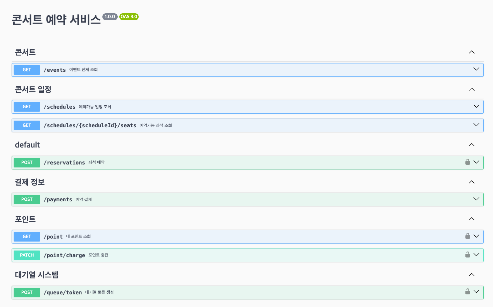

# API Spec

## Open API (Swagger)



**목차**

 - [예약가능 날짜 조회](#예약가능-날짜-조회)
 - [좌석 조회](#좌석-조회)
 - [잔액 조회](#잔액-조회)
 - [잔액 충전](#잔액-충전)
 - [대기열 토큰 발급](#대기열-토큰-발급)
 - [좌석 예약](#좌석-예약)
 - [예약 결제](#예약-결제)

## 예약가능 날짜 조회

### `GET /events/:eventId/schedules/available`

이벤트의 예약 가능한 날짜를 조회합니다.

#### Parameters

| Name      | Type     | Description                      |
| --------- | -------- | -------------------------------- |
| `eventId` | `string` | 특정 이벤트의 고유 식별자입니다. |

#### Example Request

```http
GET /events/01J1XK5P3WHGN9Z9Z9CE4W21SK/schedules/available HTTP/1.1
HOST: localhost:3000
```

#### 200 OK

```http
HTTP/1.1 200 OK
Content-Type: application/json

{
  "status": "OK",
  "message": "",
  "data": {
    "schedules": [
      {
        "id": "01J1XK6493RX5NNJRANS982FNK",
        "eventId": "01J1XK5P3WHGN9Z9Z9CE4W21SK",
        "date": "2024-07-04"
      },
    ]
  }
}
```

#### 404 Not Found

`eventId`로 이벤트를 찾을 수 없을 경우 `404 Not Found`를 반환합니다.

```http
HTTP/1.1 404 Not Found
Content-Type: application/json

{
  "statusCode": 404,
  "message": "Not Found",
  "error": "존재하지 않는 이벤트입니다."
}
```

## 좌석 조회

### `GET /schedules/:scheduleId/seats`

스케줄의 예약 가능한 좌석을 조회합니다.

#### Parameters

| Name         | Type     | Description                      |
| ------------ | -------- | -------------------------------- |
| `scheduleId` | `string` | 특정 스케줄의 고유 식별자입니다. |

#### Response Body

| Field            | Type                                       | Description |
| ---------------- | ------------------------------------------ | ----------- |
| `seats`          | `array`                                    | 좌석 목록   |
| `seats[].id`     | `string`                                   | 좌석 목록   |
| `seats[].number` | `number`                                   | 좌석 목록   |
| `seats[].status` | `"PENDING" \| "IN_PROGRESS" \| "COMPLTED"` | 좌석 목록   |

#### Example Request

```http
GET /schedules/01J1XK6493RX5NNJRANS982FNK/seats HTTP/1.1
HOST: localhost:3000
```

#### 200 OK

```http
HTTP/1.1 200 OK
Content-Type: application/json

{
  "status": "OK",
  "message": "",
  "data": {
    "seats": [
      {
        "id": "01J1XT311VHMZTE1WX3MYJV28S"
        "number": 1,
        "status": "PENDING"
      }
    ]
  }
}
```

#### 404 Not Found

`scheduleId`로 스케줄을 찾을 수 없을 경우 `404 Not Found`를 반환합니다.

```http
HTTP/1.1 404 Not Found
Content-Type: application/json

{
  "statusCode": 404,
  "message": "Not Found",
  "error": "존재하지 않는 스케줄입니다."
}
```

## 잔액 조회

### `GET /point`

내 잔액을 조회합니다.

#### Authorization

`Bearer` 토큰을 이용한 사용자 인증이 필요합니다.

```http
Authorization: Bearer {userToken}
```

#### Response Body

| Field     | Type      | Description   |
| --------- | --------- | ------------- |
| `balance` | `decimal` | 소유중인 금액 |

#### Example Request

```http
GET /point HTTP/1.1
HOST: localhost:3000
Authorization: Bearer {userToken}
```

#### 200 OK

```http
HTTP/1.1 200 OK
Content-Type: application/json

{
  "status": "OK",
  "message": "",
  "data": {
    "balance": "20000.10"
  }
}
```

#### 401 Unauthorized

Authorization 인증 정보가 존재하지 않을 경우 발생하는 에러입니다.

```http
HTTP/1.1 401 Not Found
Content-Type: application/json

{
  "statusCode": 401,
  "message": "Unauthorized"
}
```

#### 403 Forbidden

`Bearer` 토큰이 잘못되었거나 만료 또는 존재하지 않는 사용자 발생하는 에러입니다.

```http
HTTP/1.1 401 Not Found
Content-Type: application/json

{
  "statusCode": 401,
  "message": "Unauthorized"
}
```

## 잔액 충전

### `PATCH /point/charge`

내 잔액을 충전합니다.

#### Authorization

`Bearer` 토큰을 이용한 사용자 인증이 필요합니다.

```http
Authorization: Bearer {userToken}
```

#### Request Body

| Field    | Type      | Description |
| -------- | --------- | ----------- |
| `amount` | `decimal` | 충전할 금액 |

#### Response Body

| Field     | Type      | Description      |
| --------- | --------- | ---------------- |
| `balance` | `decimal` | 증가한 소유 금액 |

#### Example Request

```http
PATCH /point/charge HTTP/1.1
HOST: localhost:3000
Content-Type: application/json
Authorization: Bearer {userToken}

{
  "amount": "1000"
}
```

#### 200 OK

```http
HTTP/1.1 200 OK
Content-Type: application/json

{
  "status": "OK",
  "message": "",
  "data": {
    "balance": "21000.10"
  }
}
```

#### 400 Bad Request

```http
HTTP/1.1 400 Bad Request
Content-Type: application/json

{
  "statusCode": 400,
  "message": "Bad Request",
  "error": "잘못된 형식의 금액을 입력하였습니다."
}
```

#### 401 Unauthorized

Authorization 인증 정보가 존재하지 않을 경우 발생하는 에러입니다.

```http
HTTP/1.1 401 Not Found
Content-Type: application/json

{
  "statusCode": 401,
  "message": "Unauthorized"
}
```

#### 403 Forbidden

`Bearer` 토큰이 잘못되었거나 만료 또는 존재하지 않는 사용자 발생하는 에러입니다.

```http
HTTP/1.1 401 Not Found
Content-Type: application/json

{
  "statusCode": 401,
  "message": "Unauthorized"
}
```

## 대기열 토큰 발급

### `POST /queue-token`

대기열 토큰을 발행합니다.

대기열 토큰을 이용하여 대기열 서비스에 진입할 수 있습니다.

#### Authorization

`Bearer` 토큰을 이용한 사용자 인증이 필요합니다.

```http
Authorization: Bearer {userToken}
```

#### Response Body

| Field        | Type     | Description |
| ------------ | -------- | ----------- |
| `queueToken` | `string` | 대기열 토큰 |

#### Example Request

```http
POST /queue-token HTTP/1.1
HOST: localhost:3000
Authorization: Bearer {userToken}
```

#### 201 Created

```http
HTTP/1.1 201 Created
Content-Type: application/json

{
  "status": "OK",
  "message": "",
  "data": {
    "queueToken": "..."
  }
}
```

#### 401 Unauthorized

Authorization 인증 정보가 존재하지 않을 경우 발생하는 에러입니다.

```http
HTTP/1.1 401 Not Found
Content-Type: application/json

{
  "statusCode": 401,
  "message": "Unauthorized"
}
```

#### 403 Forbidden

`Bearer` 토큰이 잘못되었거나 만료 또는 존재하지 않는 사용자 발생하는 에러입니다.

```http
HTTP/1.1 401 Not Found
Content-Type: application/json

{
  "statusCode": 401,
  "message": "Unauthorized"
}
```

#### 409 Conflict

이미 대기열 토큰을 발행했다면 에러가 발생합니다.

```http
HTTP/1.1 409 Conflict

{
  "status": 409,
  "message": "Conflict",
  "error": "이미 토큰을 발행하였습니다."
}
```

## 좌석 예약

### `POST /reservations`

좌석을 예약합니다.

예약된 좌석은 결제가 완료될 때까지 5분 동안 임시 할당됩니다.

5분안에 결제를 완료하지 못할 경우, 예약은 취소되고 임시 할당은 해제됩니다.

#### Request Body

| Field     | Type     | Description                      |
| -------- | -------- | -------------------------------- |
| `seatId` | `string` | 예약할 좌석의 고유 식별자입니다. |

#### Authorization

`대기열 토큰`을 이용하여 사용자를 인증합니다.

```http
Authorization: Bearer {queueToken}
```

#### Response Body

| Field             | Type                        | Description        |
| ----------------- | --------------------------- | ------------------ |
| `id`              | `string`                    | 예약 고유 식별자   |
| `scheduleDate`    | `date`                      | 예약 날짜          |
| `seatNumber`      | `date`                      | 좌석 번호          |
| `status`          | `"TEMP_ASSIGNED" \| "PAID"` | 예약 상태          |
| `event`           | `object`                    | 이벤트             |
| `event.id`        | `string`                    | 이벤트 고유 식별자 |
| `event.title`     | `string`                    | 이벤트 제목        |
| `event.address`   | `string`                    | 이벤트 장소        |
| `event.startDate` | `string`                    | 이벤트 시작일      |
| `event.endDate`   | `string`                    | 이벤트 종료일      |
| `reservedDate`    | `datetime`                  | 예약일             |
| `expiredDate`     | `datetime`                  | 임시할당 만료 시간 |

#### Example Request

```http
POST /reservations HTTP/1.1
HOST: localhost:3000
Authorization: Bearer {queueToken}
Content-Type: application/json

{
  "seatId": "01J1XT311VHMZTE1WX3MYJV28S"
}
```

#### 201 Created

```http
HTTP/1.1 201 Created
Content-Type: application/json

{
  "status": "OK",
  "message": "",
  "data": {
    "id": "01J1Y5GHE6RD7PN324EMV0YJEK",
    "scheduleDate": "2024-07-22",
    "seatNumber": 1,
    "status": "TEMP_ASSIGNED",
    "event": {
      "id": "01J1XK5P3WHGN9Z9Z9CE4W21SK",
      "title": "뉴진스 팬 미팅, Bunnies Camp 2024 Tokyo Dome",
      "address": "Tokyo Dome Bunnes Camp",
      "startDate": "2024-07-01",
      "endDate": "2024-07-31"
    },
    "reservedDate": "2024-07-04T15:05:33Z",
    "expiredDate": "2024-07-04T15:10:33Z",
  }
}
```

#### 404 Not Found

`seatId`로 좌석을 찾을 수 없을 경우 에러를 반환합니다.

```http
HTTP/1.1 404 Not Found
Content-Type: application/json

{
  "statusCode": 404,
  "message": "Not Found",
  "error": "지정된 좌석을 찾을 수 없습니다."
}
```

#### 409 Conflict

좌석이 이미 예약되었거나 임시 할당되어 있을 경우 예약할 수 없습니다.

```http
HTTP/1.1 409 Conflict
Content-Type: application/json

{
  "statusCode": 409,
  "message": "Conflict",
  "error": "좌석이 이미 예약되었거나 임시 할당되어 있습니다."
}
```

## 예약 결제

### `POST /payments`

예약 건을 결제합니다.

결제가 끝나면 예약이 완료됩니다.

#### Request Body

| Field            | Type     | Description               |
| --------------- | -------- | ------------------------- |
| `reservationId` | `string` | 예약의 고유 식별자입니다. |

#### Authorization

`Bearer` 토큰을 이용한 사용자 인증이 필요합니다.

```http
Authorization: Bearer {userToken}
```

#### Response Body

| Field           | Type       | Description      |
| --------------- | ---------- | ---------------- |
| `reservationId` | `string`   | 예약 고유 식별자 |
| `amount`        | `decimal`  | 결제 금액        |
| `paidDate`      | `datetime` | 결제일           |

#### Example Request

```http
POST /payments HTTP/1.1
HOST: localhost:3000
Authorization: Bearer {userToken}
Content-Type: application/json

{
  "reservationId": "01J1Y5GHE6RD7PN324EMV0YJEK"
}
```

#### 201 Created

```http
HTTP/1.1 201 Created
Content-Type: application/json

{
  "status": "OK",
  "message": "",
  "data": {
    "reservationId": "01J1Y5GHE6RD7PN324EMV0YJEK",
    "amount": "220000",
    "paidDate": "2024-07-04T15:10:33Z",
  }
}
```

#### 404 Not Found

`reservationId`로 예약을 찾을 수 없을 경우 에러를 반환합니다.

```http
HTTP/1.1 404 Not Found
Content-Type: application/json

{
  "statusCode": 404,
  "message": "Not Found",
  "error": "지정된 예약을 찾을 수 없습니다."
}
```

#### 422 Unprocessable Content

소유 잔액이 부족할 경우 예러를 반환합니다.

```http
HTTP/1.1 422 Unprocessable Content
Content-Type: application/json

{
  "statusCode": 422,
  "message": "Unprocessable Content",
  "error": "소유 잔액이 결제 금액보다 부족합니다."
}
```
