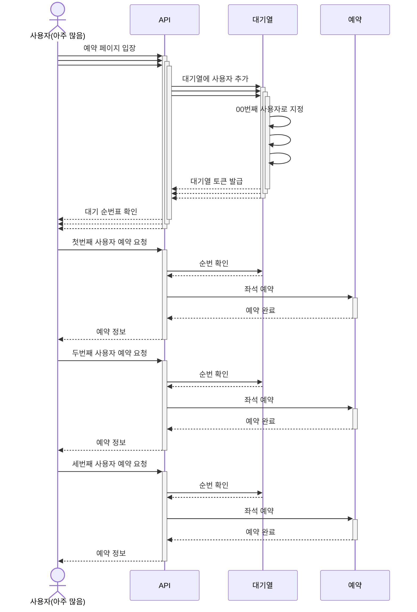
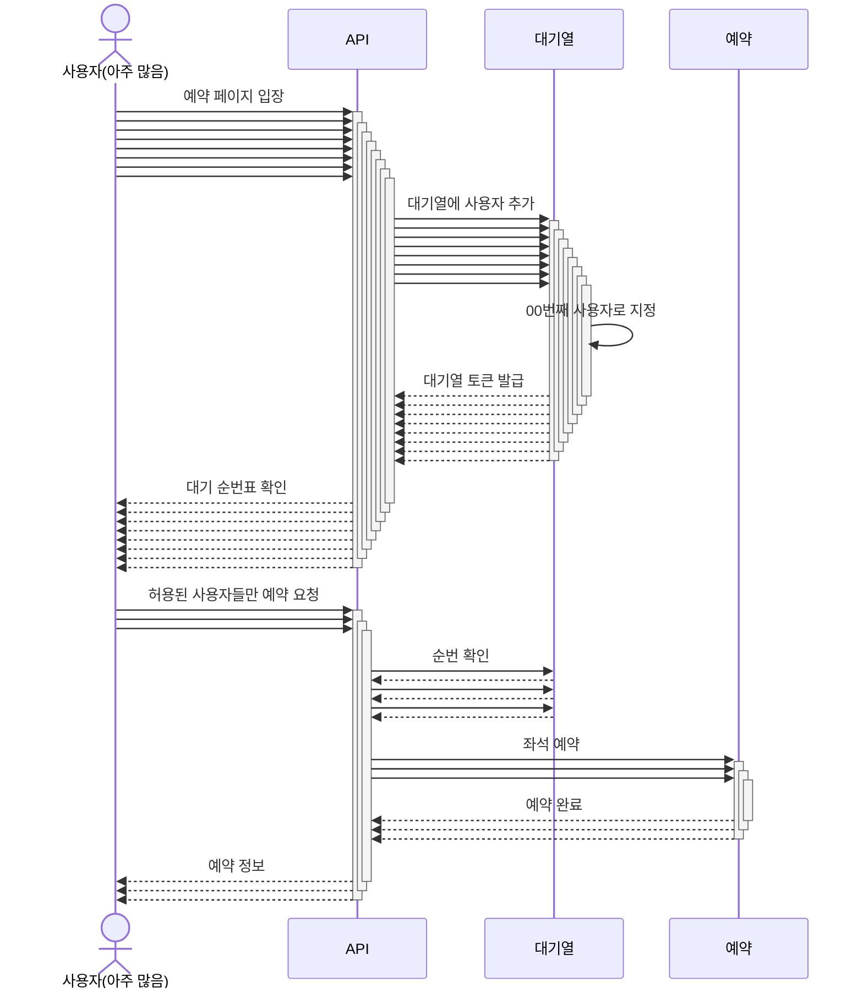
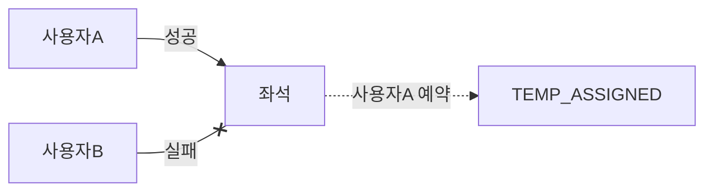
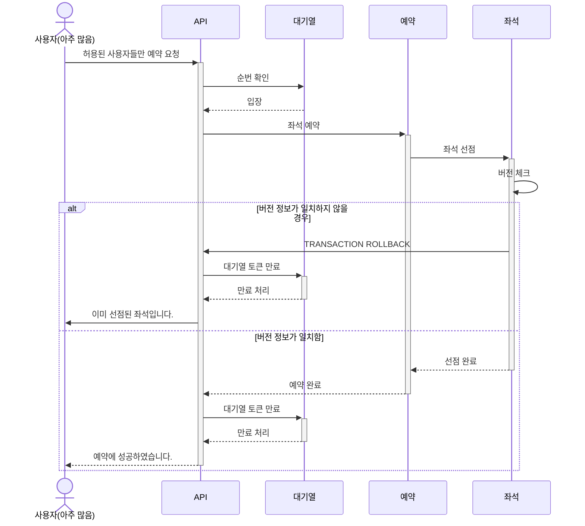
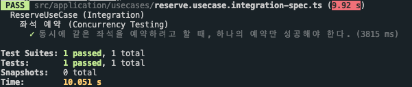
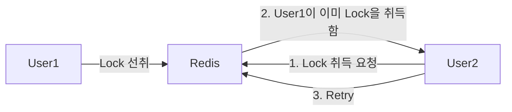
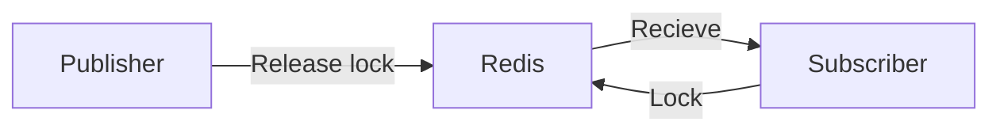
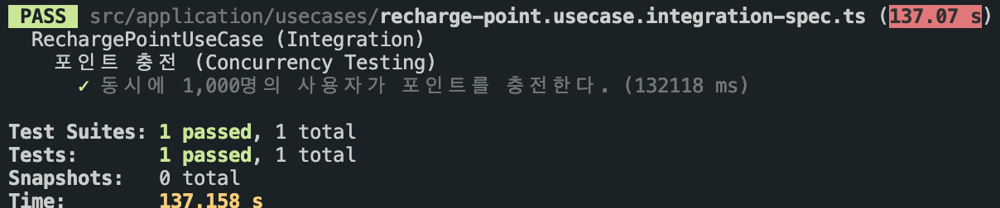

# 동시성 문제와 유즈케이스 분석

콘서트 예약 서비스에서 동시성 문제에 대한 분석 자료를 정리하였습니다.

## 목차

- [Use Case #1: 좌석 예약](#use-case-1-좌석-예약)
- [Use Case #2: 포인트 충전](#use-case-2-포인트-충전)

<br />

## Use Case #1: 좌석 예약

콘서트 예약 서비스에서 좌석을 예약하기 위한 유즈케이스입니다.

### 1. 요구사항

- 예약을 통해 좌석을 임시로 할당 받습니다.
- 좌석의 임시 할당은 5분동안 유지됩니다.
- 임시 할당은 결제가 완료되어야 예약 처리됩니다.
- **대기열을 통과한 사용자만 이용할 수 있습니다.**

### 2. 동시성 문제

> [!NOTE]
>
> **대기열이 있다면 동시성 이슈를 다룰 필요가 없지 않나요?**
>
> 그렇지 않습니다. 서버가 받아들일 수 있는 사용자의 수가 1명이 아닌 10명일 수 있고, 100명일 수 있습니다.
> 또한, 사용자는 대기열이 통과된 순간 한 번에 예약하려고 하기 때문에 동시성 이슈가 발생할 여지가 있습니다.

사용자는 대기열 순번이 돌아왔을 때 예약을 진행할 수 있습니다.

만약 대량의 인원이 예약을 진행하려고 해도 대기열 시스템을 통해 정해진 인원만 예약을 받을 수 있는 시스템입니다.



입장 가능한 인원이 한 명일 경우 동시성 이슈가 발생하지 않습니다. 하지만, 보통 한 명만 받지는 않죠. 입장 허용 인원이 10명일 수도 있고 1,000명, 10,000명 일 수도 있습니다.

이러한 상황은 대규모의 동시성을 제어해야 하는 상황은 아닙니다. 그렇다고 해서 동시성 이슈를 배제할 수는 없습니다.

예를 들어 한 번에 입장 가능한 인원이 10명이라고 칩시다. 순번이 돌아오는 시점 즉, 10명이 한 번에 입장하여 빠르게 예약을 진행할 수 있습니다. (한국인 특성상 어떻게든 좋은 자리를 차지하려고 전쟁이 벌어지겠죠)



### 3. 해결 방법

이러한 상황에서는 낙관적 락(optimistic lock)을 이용해 문제를 해결하는 것이 최적이라고 판단됩니다.

비관적 락이 아닌 낙관적 락을 사용하는 이유는 다음과 같습니다.

> [!NOTE]
> 낙관적 락은 데이터베이스에 대한 변경이 드물게 발생하고, 충돌 가능성이 낮은 환경에서 유용합니다.
> 왜냐하면, 이 방식은 충돌이 발생할 것이라고 '낙관적'으로 가정하고, 실제로 충돌이 발생했을 때만 대응하기 때문입니다.

#### [3.1] Optimistic Lock을 사용하는 이유

1. 예약 유즈케이스는 대기열을 통해 대규모 요청을 일부 막아줍니다. 때문에 충돌 가능성이 비교적 낮은 편입니다.
2. 낙관락은 충돌이 발생한 시점에 대응할 수 있기 때문에 성능 저하를 최소화하고 동시성을 높이는데 유리합니다. 따라서 충돌 가능성이 비교적 낮은 예약 유즈케이스에 적합하다고 판단됩니다.
3. 비관락과 다르게 낙관락은 충돌이 발생하면 선취한 요청을 제외한 나머지 요청은 자연스럽게 배제됩니다. 이러한 방식은 예약 유즈케이스에 (좌석을 예약하면 끝) 적합하다고 생각합니다.



#### [3.2] Optimistic Locking을 통한 동시성 제어하기



#### [3.3] 동시성 테스트 진행

낙관적 락을 이용해 동시성을 제어할 수 있는지 테스트 코드를 작성하였습니다.

> _[예약 유즈케이스 | 통합 테스트 코드 보러가기](https://github.com/boy672820/hhplus-server-concert/blob/step-11/src/application/usecases/reserve.usecase.integration-spec.ts)_



테스트 조건은 다음과 같습니다.

- 예약 유즈케이스 테스트 실시합니다.
- 예약려는 좌석은 한 개입니다.
- 최대 1,000명의 사용자가 동시에 예약을 시도합니다.

> [!NOTE] >**최대 인원이 1,000명인 이유?**
>
> 예약의 경우 대량의 요청이 발생해도 대기열 시스템을 통과한 인원만이 예약을 진행합니다.
> 따라서, 예약할 수 있는 인원 = 대기열 통과하여 입장한 인원이 많지 않을 것으로 판단되어 1,000명으로 잡았습니다.

<br />

## Use Case #2: 포인트 충전

콘서트 예약 서비스에서 잔액을 충전하기 위한 유즈케이스입니다.

### 1. 동시성 문제

포인트 충전의 경우, 포인트를 충전하려는 사용자를 조회한 후 현재 잔액에서 증가하려는 금액을 더하는 방식으로 구현되어 있습니다.

#### 포인트를 충전하는 방식

1. 사용자의 현재 잔액을 조회한다. (`select balance from user where id = ?`)
1. 조회한 현재 잔액에서 충전 금액을 더한 후 업데이트한다. (`update user set balance += ? where id = ?`)

때문에 한 사용자가 여러 건의 포인트 충전 요청한다면 동시성 이슈가 발생하게 됩니다.

아래는 동시에 포인트 충전 요청이 들어올 경우 쿼리가 어떻게 꼬이는지 보여주는 예시입니다.

| TX1                                                 | Data             | TX2                                                 |
| --------------------------------------------------- | ---------------- | --------------------------------------------------- |
| begin;                                              |                  |                                                     |
| select balance from user where id = ?;              | balance = 0      |                                                     |
|                                                     |                  | begin;                                              |
|                                                     | balance = 0      | select balance from user where id = ?;              |
| update user set balance = (0 + 10,000) where id = ? | balance = 10,000 |                                                     |
|                                                     | balance = 10,000 | update user set balance = (0 + 10,000) where id = ? |
| commit;                                             |                  |                                                     |
|                                                     |                  | commit;                                             |

> [!IMPORTANT]
> 쿼리는 각각 사용자 잔액을 10,000 포인트 증가시키려고 합니다.
> 두 번의 요청이 들어와 최종 포인트 잔액은 20,000 포인트가 되어야 하지만 결과적으로는 10,000 포인트가 되었습니다.
> 이렇게 된 이유는 조회 시점에서 포인트 잔액을 가져올 때, 업데이트되지 않은 결과를 가져오기 때문입니다.
> 즉, DB 테이블의 사용자 row라는 임계 구역에서 두 트랜잭션의 경쟁 조건이 발생하게 됩니다.

### 2. 해결 방법

낙관적 락을 이용하여 문제를 해결할 수 있지만, 이번에는 **분산 락(distributed lock)**을 통해 문제를 해결해 보려고 합니다.

#### [2.1] Redlock을 이용한 구현

Redlock은 Redis에서 제공하는 분산 합의 알고리즘입니다. Locking 시스템을 Redis라는 외부 시스템에 의존하므로써 전체적인 시스템에 내결함성이 증가하게 됩니다.

이를 해결하기 위해 여러 개의 Redis 인스턴스를 구성하여 내결함성을 낮출 수 있습니다.

구현 코드는 다음과 같습니다.

```typescript
async function rechargePoint(id: string, amount: number) {
  // Redis에서 lock 취득
  const lock = await redlock.acquire(['user_point', id], 1000);

  const user = await userRepository.findById(id);

  await userRepository.update(id, { balance: user.balance + amount });

  // 취득한 lock 반환
  await lock.release();
}
```

#### [2.2] Lock 취득에 실패하였을 경우?

만약 Redis에서 lock 취득에 실패할 경우, 재시도하여 lock을 취득할 수 있어야 합니다.

물론 Redlock에서는 재시도(retry) 옵션을 제공해주고 있습니다만, 폴링 방식이라 Redis에 불필요한 요청이 늘어나게 됩니다.



#### [2.3] Redis Pub/Sub

> [구현코드 보러가기](https://github.com/boy672820/hhplus-server-concert/blob/04b0b9249c962eaf59421c241075409c1cd79993/src/lib/redis/redlock.service.ts#L16)

가장 효율적인 방법은 Redis의 Pub/Sub 기능을 이용하여 Lock을 취득하는 방식입니다.

원리는 다음과 같습니다.

1. Lock 취득에 실패
2. 재시도하기 위해 Redis 채널을 구독(subscribe)
3. 이미 Lock을 선점한 사용자가 반환 후 Redis 채널에 'released' 메시지를 발행(publish)
4. 2번이 'released' 메시지를 수신하여 Lock 취득 재시도



```typescript
async function acquireLock(resources: string[], ttl = 1000) {
  try {
    const lock = await redlock.acquire(resources, ttl);
    return {
      release: async () => {
        await lock.release();
        // lock을 반환하면 'released'를 발행합니다.
        redpub.publish('lock:user_point', 'released');
      },
    };
  } catch (e) {
    return new Promise((resolve, reject) => {
      // lock 취득에 실패하여 채널을 구독합니다.
      redsub.subscribe('lock:user_point', (err) => {
        if (err) {
          redsub.unsubscribe();
          reject(err);
        }
      });
      // 'released' 메시지가 발행되면 재시도합니다.
      redsub.once('message', (message) => {
        if (message === 'released') {
          redsub.unsubscribe();
          resolve(acquireLock(resources, ttl));
        }
      });
    });
  }
}
```

#### [2.4] 동시성 테스트 진행



동시성 테스트 결과 최대 1,000명까지는 버텼지만, 10,000명에서 테스트했을 때 시간이 너무 오래걸리는 문제가 있었습니다.

- 1,000명 테스트: 소요시간 대략 5분
- 10,000명 테스트: 소요시간 10분 이상 (Timeout)
