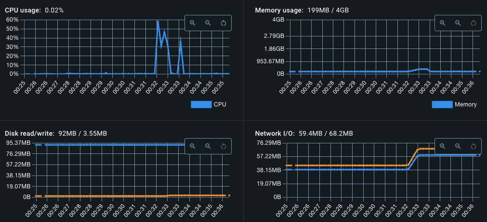
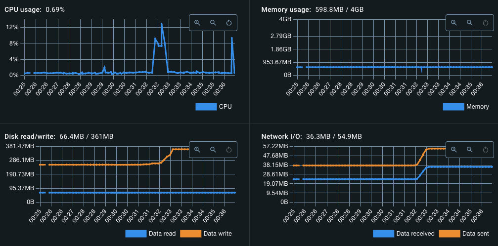
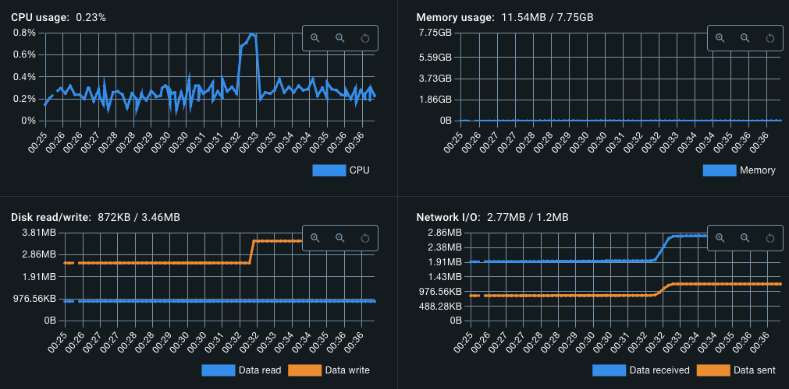
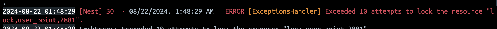

# 부하 테스트 및 개선

부하 테스트를 통해 서비스 장애 지점을 파악하고, 그에 따른 개선 방안을 자료로 정리하였습니다.

## 목차

1. 시나리오와 워크로드 모델링
2. 테스트 결과 분석
3. 문제점 개선

<br />

## 1. 시나리오와 워크로드 모델링

개선점을 확인하기 전에 전체적인 시나리오와 워크로드 모델링의 방향을 잡아야 합니다.

### [1.1] 시나리오

시나리오는 사용자의 입장에서 서비스가 어떻게 사용되는지를 모방하는 것을 말합니다. 시스템이 실제 운영 환경에서 어떻게 사용되는지를 모방하여 테스트를 수행하는 과정입니다.

예상하는 사용자 시나리오는 다음과 같습니다.

```
사용자 시나리오

1. 콘서트 조회(1)
2. 포인트 충전
3. 콘서트 조회(2)
4. 일정 조회
5. 좌석 조회
6. 대기열 토큰 발행
7. 매초마다 입장 가능여부 조회 (polling)
8. 좌석 예약
9. 예약 결제
```

> [!NOTE]
>
> 기본적으로 콘서트 예약을 위해 사용하게 될 엔드포인트들을 요청 순서대로 정리해 보았습니다.

#### API Endpoints

| API              | Endpoint                           | Parameters                                | Header                 | Response Status |
| ---------------- | ---------------------------------- | ----------------------------------------- | ---------------------- | --------------- |
| 포인트 충전      | `PATCH /point/charge`              |                                           | `Authorization Bearer` | 200             |
| 전체 콘서트 조회 | `GET /events`                      |                                           |                        | 200             |
| 콘서트 일정 조회 | `GET /events/:eventId/schedules`   | `startDate(ISO-8601)` `endDate(ISO-8601)` |                        | 200             |
| 좌석 조회        | `GET /schedules/:scheduleId/seats` |                                           |                        | 200             |
| 좌석 예약        | `POST /reservations`               |                                           | `Authorization Bearer` | 201             |
| 대기열 토큰 발행 | `POST /queue/token`                |                                           | `Authorization Bearer` | 201             |

<br />

### [1.2] 워크로드 모델링

작성된 시나리오를 이용하여 목표로 하는 성능 지표를 가정하여 설정합니다. 이를 워크로드 모델링이라고 불립니다.

아래와 같이 성능 테스트를 수행할 대상(워크로드)을 나열하고, 이중 업무 중요도가 높은 순으로 가설을 설정합니다.

<table>
  <tr>
    <th>Application</th>
    <th>Target</th>
    <th>User</th>
    <th>Response Time(s)</th>
    <th>Think Time(s)</th>
    <th>TPS</th>
  </tr>
  <tr>
    <td rowspan=6>콘서트 예약 서비스</td>
    <td>전체 콘서트 조회</td>
    <td>150</td>
    <td>1s</td>
    <td>4s</td>
    <td>30</td>
  </tr>
  <tr>
    <td>콘서트 일정 조회</td>
    <td>100</td>
    <td>1s</td>
    <td>4s</td>
    <td>20</td>
  </tr>
  <tr>
    <td>좌석 조회</td>
    <td>100</td>
    <td>1s</td>
    <td>4s</td>
    <td>20</td>
  </tr>
  <tr>
    <td>좌석 예약</td>
    <td>60</td>
    <td>1s</td>
    <td>5s</td>
    <td>10</td>
  </tr>
  <tr>
    <td>예약 결제</td>
    <td>20</td>
    <td>1s</td>
    <td>1s</td>
    <td>10</td>
  </tr>
  <tr>
    <td>포인트 충전</td>
    <td>20</td>
    <td>1s</td>
    <td>1s</td>
    <td>10</td>
  </tr>
  <tr>
    <td colspan=4></td>
    <td>Total: </td>
    <td>100</td>
  </tr>
</table>

<br />

### [1.3] 테스트 조건

#### 테스트 환경: Macbook pro Apple M1

> Nest.js & MySQL 리소스 제한은 다음과 같습니다.

- CPU: 2 Core
- Memory: 4GB

#### 테스트 대상: 목업 데이터

> '전체 콘서트 조회', '콘서트 일정 조회', '좌석 조회' 워크로드에서 조회하게 될 목업 데이터입니다.

- _콘서트: 300건_
- _스케줄: 1,500건_
- _좌석: 15,000건_

#### 테스트 목적: 평균 부하

> 평균 부하 테스트를 통해 가설을 세운 워크로드 성능에 부합한지 확인할 수 있습니다.

| 테스트 조건 | 설명                                                                                                                                  | 조건 |
| ----------- | ------------------------------------------------------------------------------------------------------------------------------------- | ---- |
| Ramp-up     | 목표로 하는 부하를 발생시키기 위한 웜업 단계입니다. 전체 테스트 시간에 5~15%를 차지합니다.                                            | 5s   |
| Core-time   | 목표로 설정한 사용자가 접속한 상태에서 일정 시간동안 트래픽을 유지합니다. 이 구간에서 전반적인 부하 테스트 성과를 평가할 수 있습니다. | 25s  |
| Ramp-down   | 코어타임이 종료되면 유지되던 트래픽을 점진적으로 감소시킵니다.                                                                        | 5s   |

<br />
<br />

---

<br />

## 2. 테스트 결과 분석

가설을 세운 워크로드를 기반으로, 테스트를 실시한 후 결과를 분석합니다.

### [2.1] 부하 테스트 결과

- _테스트 진행 시간: 30s_
- _전체 요청 수: 7,408_
- _전체 평균 응답 시간: 4.1s_

<details>

```text
→    checks...............................: 33.33% ✓ 736        ✗ 1472
→    counter_event_req....................: 79     1.214985/s
→    counter_pay_reservation_req..........: 319    4.90608/s
→    counter_recharge_point_req...........: 594    9.135459/s
→    counter_reserve_seat_req.............: 417    6.413277/s
→    counter_schedule_req.................: 1215   18.686166/s
→    counter_seat_req.....................: 1191   18.317057/s
→    data_received........................: 9.0 MB 138 kB/s
→    data_sent............................: 1.5 MB 23 kB/s
→  ✗ http_req_duration....................: avg=67.9ms      min=298µs     med=2.92ms    max=1.92s     p(90)=147.61ms  p(95)=416.78ms
→      { expected_response:true }.........: avg=101.75ms    min=968µs     med=3.82ms    max=1.92s     p(90)=346.73ms  p(95)=717.64ms
→    http_req_waiting.....................: avg=67.78ms     min=262µs     med=2.81ms    max=1.92s     p(90)=146.82ms  p(95)=416.7ms
→    http_reqs............................: 7408   113.931784/s
→    iteration_duration...................: avg=4.1s        min=626.66µs  med=4s        max=15.42s    p(90)=6.11s     p(95)=9.45s
→    iterations...........................: 3870   59.518899/s
→    scenario_1_find_events...............: avg=51.942397   min=50.732873 med=50.784544 max=65.087722 p(90)=54.738919 p(95)=58.826501
→    scenario_2_find_schedules_by_event...: avg=3.346147    min=3.293208  med=3.294486  max=4.202558  p(90)=3.398874  p(95)=3.716073
→    scenario_3_find_seats_by_schedule....: avg=3.448663    min=3.359966  med=3.361515  max=4.977181  p(90)=3.549977  p(95)=3.971142
→    scenario_4_reserve_seat..............: avg=12.596746   min=11.997686 med=12.124034 max=14.90252  p(90)=14.285106 p(95)=14.652509
→    scenario_5_pay_reservation...........: avg=3.876062    min=3.155912  med=3.25816   max=7.100934  p(90)=6.137502  p(95)=6.599027
→    scenario_6_recharge_point............: avg=1.697886    min=1.685008  med=1.686497  max=2.269167  p(90)=1.702986  p(95)=1.723325
→    trend_event_duration.................: avg=4103.44938  min=4007.897  med=4011.979  max=5141.93   p(90)=4324.3746 p(95)=4647.2936
→    trend_pay_reservation_duration.......: avg=1236.463774 min=1006.736  med=1039.353  max=2265.198  p(90)=1957.863  p(95)=2105.0897
→    trend_recharge_point_duration........: avg=1008.544163 min=1000.895  med=1001.7795 max=1347.885  p(90)=1011.5738 p(95)=1023.65525
→    trend_reserve_seat_duration..........: avg=5252.843149 min=5003.035  med=5055.722  max=6214.351  p(90)=5956.889  p(95)=6110.0962
→    trend_schedule_duration..............: avg=4065.56817  min=4001.248  med=4002.8    max=5106.108  p(90)=4129.6318 p(95)=4515.0285
→    trend_seat_duration..................: avg=4107.3582   min=4001.72   med=4003.564  max=5927.822  p(90)=4228.023  p(95)=4729.6305
```

</details>

#### (1) 테스트 결과: 워크로드

<table>
  <tr>
    <th rowspan=2>Application</th>
    <th rowspan=2>Target</th>
    <th rowspan=2>User</th>
    <th rowspan=2>Response + Think Time (avg)</th>
    <th rowspan=2>Reqs</th>
    <th colspan=6>TPS</th>
  </tr>
  <tr>
    <th>avg</th>
    <th>min</th>
    <th>med</th>
    <th>max</th>
    <th>p(90)</th>
    <th>p(95)</th>
  </tr>
  <tr>
    <td rowspan=6>콘서트 예약 서비스</td>
    <td>전체 콘서트 조회</td>
    <td align=right>150</td>
    <td align=right>6.6s</td>
    <td align=right>1,064</td>
    <td align=right>160</td>
    <td align=right>263</td>
    <td align=right>177</td>
    <td align=right>51</td>
    <td align=right>141</td>
    <td align=right>75</td>
  </tr>
  <tr>
    <td>콘서트 일정 조회</td>
    <td align=right>100</td>
    <td align=right>5.6s</td>
    <td align=right>611</td>
    <td align=right>108</td>
    <td align=right>152</td>
    <td align=right>107</td>
    <td align=right>80</td>
    <td align=right>85</td>
    <td align=right>83</td>
  </tr>
  <tr>
    <td>좌석 조회</td>
    <td align=right>100</td>
    <td align=right>6.4s</td>
    <td align=right>500</td>
    <td align=right>78</td>
    <td align=right>124</td>
    <td align=right>81</td>
    <td align=right>47</td>
    <td align=right>56</td>
    <td align=right>53</td>
  </tr>
  <tr>
    <td>좌석 예약</td>
    <td align=right>60</td>
    <td align=right>6.3s</td>
    <td align=right>175</td>
    <td align=right>27</td>
    <td align=right>34</td>
    <td align=right>27</td>
    <td align=right>19</td>
    <td align=right>21</td>
    <td align=right>20</td>
  </tr>
  <tr>
    <td>예약 결제</td>
    <td align=right>20</td>
    <td align=right>5.9s</td>
    <td align=right>87</td>
    <td align=right>14</td>
    <td align=right>81</td>
    <td align=right>25</td>
    <td align=right>4</td>
    <td align=right>6</td>
    <td align=right>6</td>
  </tr>
  <tr>
    <td>포인트 충전</td>
    <td align=right>20</td>
    <td align=right>2.2s</td>
    <td align=right>543</td>
    <td align=right>236</td>
    <td align=right>537</td>
    <td align=right>504</td>
    <td align=right>29</td>
    <td align=right>284</td>
    <td align=right>36</td>
  </tr>
</table>

#### (2) 리소스 사용률

<details>
<summary>Server (Nest.js)</summary>



</details>

<details>
<summary>Database (MySQL)</summary>



</details>

<details>
<summary>In-Memory (Redis)</summary>



</details>

> [!TIP]
>
> 그래프에서 Spike가 발생하는 구간 즉, 00:32 ~ 00:34 사이에 부하 테스트가 실행되었음을 알 수 있습니다.

<br />

### [2.2] 테스트 결과 분석

```
→  ✗ http_req_failed......................: 19.94% ✓ 1314       ✗ 5275
...
→    ✗ status is 201
→     ↳  93% — ✓ 253 / ✗ 17
→    ✗ status is 409
→     ↳  0% — ✓ 0 / ✗ 270
→    ✗ status is 500
→     ↳  6% — ✓ 17 / ✗ 253
```

테스트 결과 6%의 실패율이 발생하였으며 이는 Internal Server Error로 확인되었습니다.

Internal Server Error가 발생하는 지점은 Redlock 로직이 적용된 '예약 결제' 유즈케이스입니다.

'예약 결제'의 TPS는 14로, 예상 20 TPS보다 -8 낮은 성능을 보여주고 있습니다.

| Workload  | User | Reqs | Response Time (avg) | TPS           |
| --------- | ---- | ---- | ------------------- | ------------- |
| 예약 결제 | 20   | 87   | 5.9s                | ~~20~~ **14** |

#### 결과 분석: 예약 결제

예약 걸제에서 다음과 같은 에러를 확인했습니다.

- `OptimisticLockVersionMismatchError`: 비관적 락이 적용되어, 업데이트할 때 버전이 다르면 다음과 같은 에러가 발생
- `Exceeded 10 attempts to lock the resource "..."`: (Redis)에서 너무 많은 Distributed Lock 취득 요청이 생길 경우 에러 발생



예약 결제의 경우, 좌석 테이블의 'Optimistic Lock'과 유저 포인트에 'Distributed Lock'이 적용되어 있습니다.

'Optimistic Lock'은 좌석 예약의 임시 할당 로직과 Lock 경합이 발생하여 성능적 이슈가 있습니다.

문제는 Redlock이 적용된 'Distributed Lock' 입니다.

<br />
<br />

---

<br />

## 3. 문제점 개선

분석 결과를 토대로 문제점들을 개선하여 버그를 수정하고, 성능적으로 얼마나 개선되었는지 확인해보겠습니다.

### [3.1] 개선 방안

문제가 되었던 '예약 결제'는 두 가지 Lock 경합이 발생합니다.

1. 좌석의 상태를 변경하려 할 때 발생하는 'Optimistic Lock'
2. 유저 포인트를 충전할 때 취득하는 'Distributed Lock'

위 두 가지 상황에서 발생하는 에러에 대해서 버그를 수정해보겠습니다.

#### (1) 버그 수정: `OptimisticLockVersionMismatchError`

`OptimisticLockVersionMismatchError`에 대한 예외처리가 되지 않고 있었습니다.

따라서, 다음과 같이 `OptimisticLockVersionMismatchError` 에러가 발생할 경우 예외 처리를 핸들링하도록 변경하였습니다.

```typescript
@Injectable()
export class SeatService {
  async pay({ seatId }: { seatId: string }): Promise<Seat> {
    try {
      const seat = await this.seatRepository.findById(seatId);

      if (!seat) {
        throw DomainError.notFound('좌석을 찾을 수 없습니다.');
      }

      seat.pay();

      await this.seatRepository.save(seat);

      return seat;
    } catch (e) {
      // 예외처리 핸들링
      if (e instanceof OptimisticLockVersionMismatchError) {
        throw DomainError.conflict('이미 결제된 좌석입니다.');
      }
      throw e;
    }
  }
}
```

#### (2) 버그 수정: `Exceeded 10 attempts to lock the resource "..."`

에러가 발생한 원인은 Lock을 취득하려는 리소스가 배열로 전달되어 정상적으로 Lock을 취득하지 못하였기 때문입니다.

예를 들어, 리소스가 `[lock, user_point, 1]` 배열로 전달되면 각각의 요소가 Lock을 취득하게 됩니다. 만약, `[lock, user_point, 1]` 요소 중 하나라도 Lock을 반환하지 못하였다면, Lock을 재취득하기 위한 로직이 정상적으로 실행하지 못하여 데드락 상태에 빠집니다.

```typescript
@Injectable()
export class RedlockService {
  async acquire(resources: string[], ttl = 1_000): Promise<Lock> {
    try {
      // 1. Lock을 취득하려는 리소스를 배열로 넘겨줄 경우, 정상적으로 Lock을 취득할 수 없습니다.
      const lock = await this.redlock.acquire(resources, ttl);
      return Lock.create(lock, resources);
    } catch {
      // ..retry
    }
  }

  async release(lock: Lock): Promise<void> {
    // 2. 따라서, Lock.release() 메서드로 Lock을 반환하여도 정상적으로 Lock을 취득하지 못하였기 때문에
    // 재시도 로직에서 lock을 취득할 수 없습니다. (이미 취득하고 반환은 못했기 때문에)
    await lock.release();
    const message = `released:${_resources.join(':')}`;
    this.redis.publish(Lock.channel, message);
  }
}
```

때문에 다음과 같이 단일 리소스만 Lock을 취득할 수 있게 수정하였습니다.

```typescript
@Injectable()
export class RedlockService {
  async acquire(resources: string[], ttl = 10_000): Promise<Lock> {
    try {
      const lock = await this.redlock.acquire(
        `locked:${resources.join(':')}`,
        ttl,
      );
      return Lock.create(lock, resources);
    } catch {
      // ..retry
    }
  }
}
```

### [3.2] 개선 후 성능

- TPS가 ~~14~~에서 21로 +7 TPS 개선 됨
- 응답 시간은 4.6s로 -1.3s 개선 됨
 
| Workload  | User | Reqs      | Response Time (avg) | TPS           |
| --------- | ---- | --------- | ------------------- | ------------- |
| 예약 결제 | 20   | ~~87~~ 84 | ~~5.9s~~ 4.6s                | ~~14~~ **21** |

```
→    ✗ status is 201
→     ↳  98% — ✓ 271 / ✗ 3
→    ✗ status is 409
→     ↳  1% — ✓ 3 / ✗ 271
→    ✗ status is 500
→     ↳  0% — ✓ 0 / ✗ 274

→    checks...............................: 33.33% ✓ 274        ✗ 548
→    counter_event_req....................: 1055   21.497539/s
→    counter_pay_reservation_req..........: 84     1.711652/s
→    counter_recharge_point_req...........: 498    10.147653/s
→    counter_reserve_seat_req.............: 190    3.871595/s
→    counter_schedule_req.................: 642    13.081915/s
→    counter_seat_req.....................: 532    10.840465/s
→    data_received........................: 156 MB 3.2 MB/s
→    data_sent............................: 1.1 MB 22 kB/s
→    dropped_iterations...................: 10461  213.161853/s
→    http_req_blocked.....................: avg=101µs       min=0s         med=5µs        max=36.89ms    p(90)=271.1µs    p(95)=428µs
→    http_req_connecting..................: avg=69.96µs     min=0s         med=0s         max=35.18ms    p(90)=179.1µs    p(95)=322µs
→  ✗ http_req_duration....................: avg=1.75s       min=634µs      med=617.27ms   max=18.1s      p(90)=3.44s      p(95)=13.03s
→      { expected_response:true }.........: avg=2.11s       min=6.02ms     med=818.44ms   max=18.1s      p(90)=5.07s      p(95)=13.3s
→  ✗ http_req_failed......................: 22.91% ✓ 1620       ✗ 5450
→    http_req_receiving...................: avg=632.64µs    min=8µs        med=104µs      max=97.97ms    p(90)=971µs      p(95)=1.44ms
→    http_req_sending.....................: avg=117.1µs     min=3µs        med=24µs       max=88.88ms    p(90)=73µs       p(95)=105µs
→    http_req_tls_handshaking.............: avg=0s          min=0s         med=0s         max=0s         p(90)=0s         p(95)=0s
→    http_req_waiting.....................: avg=1.75s       min=572µs      med=616.8ms    max=18.1s      p(90)=3.43s      p(95)=13.02s
→    http_reqs............................: 7070   144.064076/s
→    iteration_duration...................: avg=7.9s        min=92.99ms    med=5.58s      max=34.97s     p(90)=18.05s     p(95)=19.57s
→    iterations...........................: 3033   61.802877/s
→    scenario_1_find_events...............: avg=165.326905  min=262.38814  med=215.362205 max=54.609913  p(90)=87.672631  p(95)=60.561182
→    scenario_2_find_schedules_by_event...: avg=132.572365  min=160.096916 med=135.306661 max=101.259258 p(90)=108.338303 p(95)=103.084283
→    scenario_3_find_seats_by_schedule....: avg=98.897539   min=132.558018 med=99.798901  max=62.205809  p(90)=75.742077  p(95)=66.33595
→    scenario_4_reserve_seat..............: avg=33.048368   min=37.961499  med=35.326511  max=25.891464  p(90)=27.307998  p(95)=26.987045
→    scenario_5_pay_reservation...........: avg=21.182087   min=64.250442  med=24.927074  max=11.251155   p(90)=11.58071    p(95)=11.279366
→    scenario_6_recharge_point............: avg=190.740773  min=496.309075 med=468.849295 max=27.821711  p(90)=70.500189  p(95)=29.763168
→    trend_event_duration.................: avg=6381.296518 min=4020.761   med=4898.724   max=19318.837  p(90)=12033.4018 p(95)=17420.3998
→    trend_pay_reservation_duration.......: avg=4619.931762 min=1307.384   med=3830.8805  max=9079.947   p(90)=8767.6177  p(95)=9052.34285
→    trend_recharge_point_duration........: avg=2610.873339 min=1003.407   med=1062.175   max=17899.69   p(90)=7063.8109  p(95)=16732.08955
→    trend_reserve_seat_duration..........: avg=5749.149279 min=5005.071   med=5378.397   max=7338.326   p(90)=6957.6686  p(95)=7040.4151
→    trend_schedule_duration..............: avg=4842.638207 min=4010.071   med=4744.7775  max=6340.161   p(90)=5925.882   p(95)=6227.9135
→    trend_seat_duration..................: avg=5379.304735 min=4013.337   med=5330.72    max=8552.256   p(90)=7023.837   p(95)=8019.7842
→    vus..................................: 1      min=1        max=720
```

---

## References

- [node-redlock | npm](https://www.npmjs.com/package/redlock/v/4.2.0#usage-promise-style)
