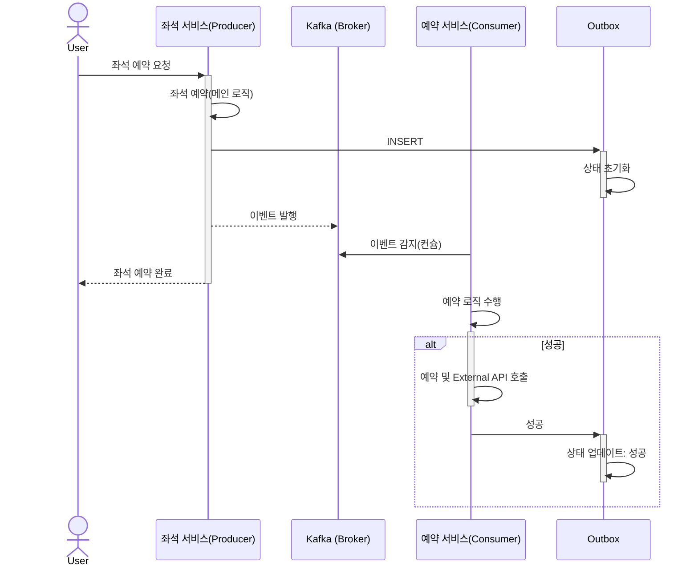

## MSA with Kafka

카프카를 이용한 MSA 구현

## 목차

- 좌석 예약

---

 

## 좌석 예약

좌석 예약 유즈케이스에서 관심사를 분리합니다.

분리된 관심사는 마이크로서비스에서 수행됩니다. 좌석 예약이 완료되면 토픽(topic)을 발행, Kafka를 바라보고 있는 Consumer(서비스)가 토픽을 캐치하여 적절한 로직을 수행합니다.

좌석 예약의 주된 관심사와, 분리된 관심사를 아래와 같은 흐름도로 파악할 수 있을 거 같습니다.

