# MSA

서비스가 확장됨에 따라 MSA로 어떻게 확장을 하면 좋을지 단계적으로 설명합니다.

## 목차

 1. [Event Storming](#1-event-storming)
 2. [Event Driven](#2-event-driven)

## 1. Event Storming

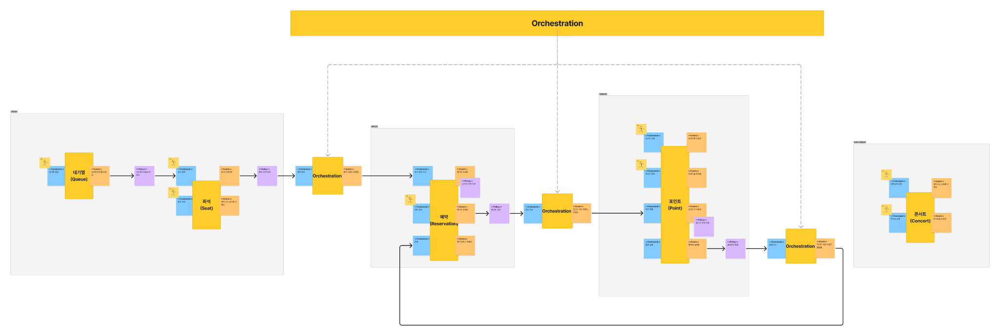

먼저 Monolithic 구조의 서비스들을 어떻게 분리하면 좋을지 이벤트 스토밍을 통해 알아보겠습니다.

>[!TIP]
>
>이벤트 스토밍은 DDD 방법론 중 하나로, 시스템에서 발생하는 이벤트를 중심으로 분석하는 기법입니다. 특히, Non-Blocking, Event-driven한 MSA 기반 시스템을 분석 및 개발에 필요한 도메인에 대한 빠른 이해를 도모하는데 유리합니다.

이벤트 스토밍은 다음과 같은 순서로 진행됩니다.

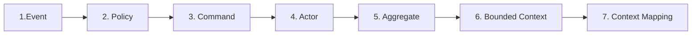

1. 서비스에서 발생하는 **이벤트(Event)**를 도출합니다.
2. 이벤트가 발생한 후 연이어 발생하는 **정책(Policy)**에 대해 도출합니다.
3. 이벤트를 발생하는 행위인 **커맨드(Command)**를 도출합니다.
4. 커맨드를 발생시키는 주체인 **Actor**를 정의합니다.
5. 도메인을 중심으로 하나의 트랜잭션에 묶여야 할 중심인 **Aggregate**를 정의합니다.
6. 마이크로서비스 구성 단위로 정의할 **Bounded Context** 도출합니다.
7. 마이크로서비스 간에 통신을 설명하는 **Context를 매핑**합니다.

### [1.1] Services

기존 Monolithic 구조에서 각각의 모듈을 서비스로 나누어보겠습니다.

- **예약**: 예약을 생성하고 관리하는 서비스입니다.
- **결제**: 결제와 정산을 담당하는 서비스입니다.
- **좌석**: 좌석에 대한 예약을 담당하는 서비스입니다.
- **스케줄**: 현재 콘서트와 스케줄을 확인하는 서비스입니다.

#### `Microservice: 좌석`

- 대기열 입장을 통한 토큰 발급과 현재 순서를 체크합니다.
- 대기열 순서가되면 예약을 통해 좌석을 점유합니다.

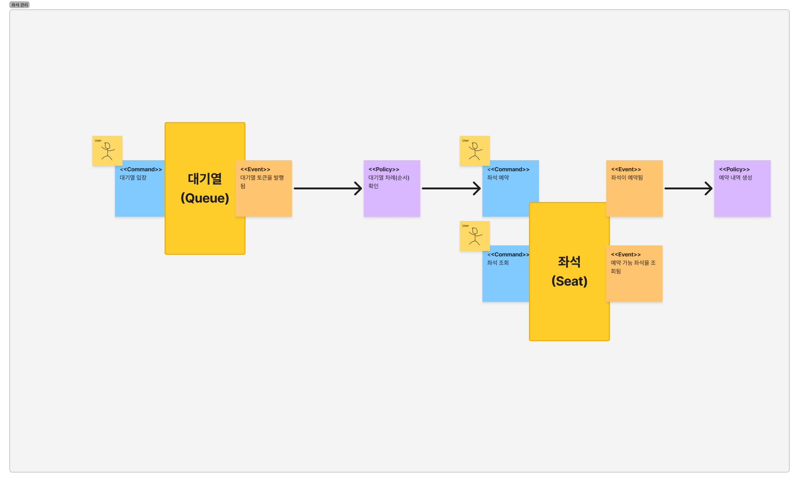

#### `Microservice: 예약`

- 예약 정보를 생성합니다.
- 예약 결제에 대한 커맨드를 제공합니다.
- 결제가 실패할 경우 예약 실패 처리합니다.

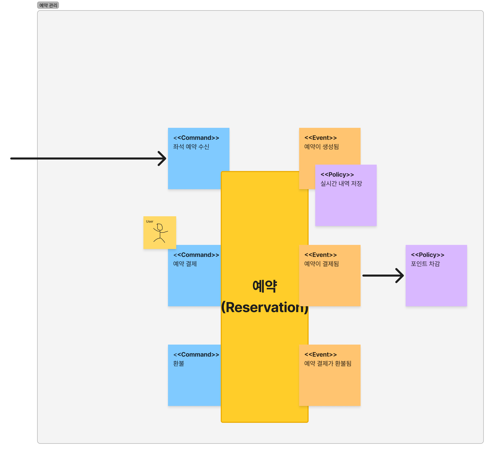

#### `Microservice: 결제`

- 현재 보유중인 포인트를 조회합니다.
- 포인트를 충전합니다.
- 결제에 의한 포인트 차감 로직을 실행합니다.
- 결제가 실패할 경우 환불에 대한 요청을 진행합니다.

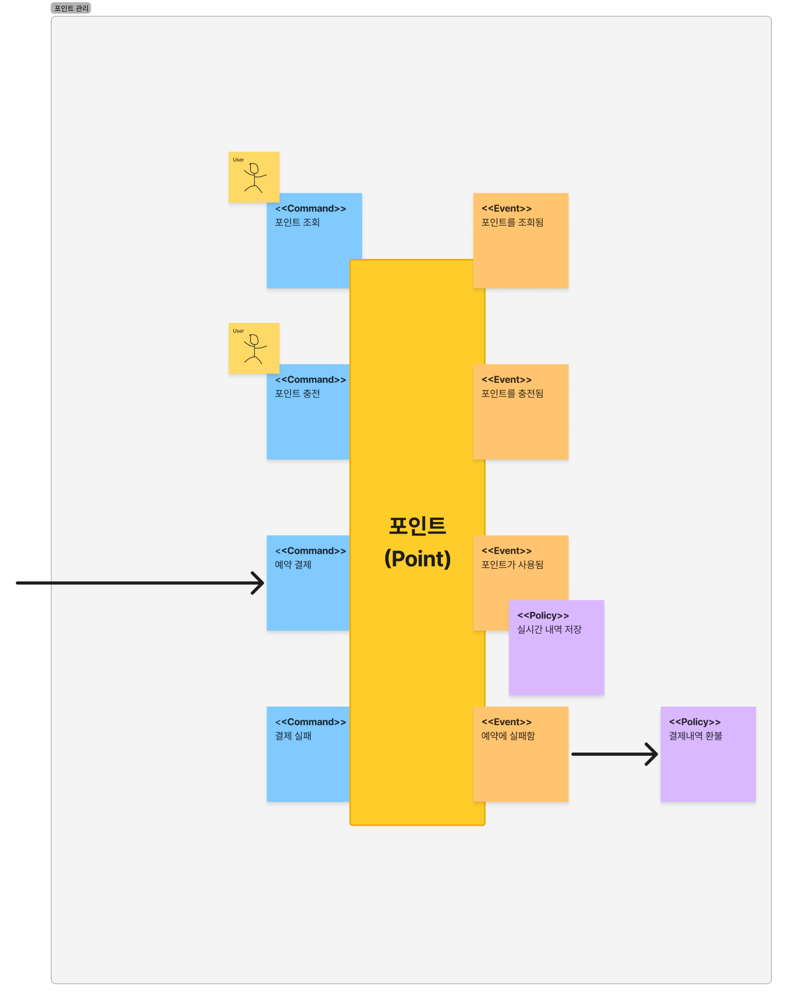

#### `Microservice: 스케줄`

- 현재 진행중인 콘서트를 조회합니다.
- 콘서트의 예약 가능한 날짜를 조회합니다.

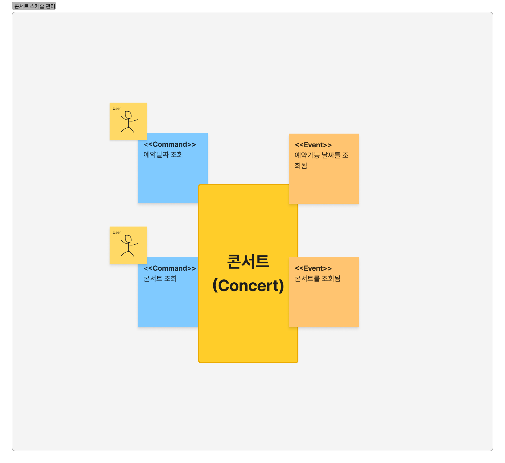

### [1.2] Orchestration

>[!IMPORTANT]
>
>각각의 모듈을 마이크로서비스로 분리함으로써 발생하는 문제는 유즈케이스를 수행하기 위해 복잡도가 증가한다는 것입니다.

이해를 위해 좌석 예약 유즈케이스로 예로 들어보겠습니다. 좌석 예약은 좌석 점유와 예약 정보를 생성을 수행해야 합니다. 하지만, '좌석'과 '예약'은 각각 마이크로서비스로 분리되어 있습니다. 때문에 예약을 실행하는 주체는 누구이며, 두 로직 중 하나가 실패할 경우 어떻게 보상 로직을 실행해야 하는지 알아야합니다.

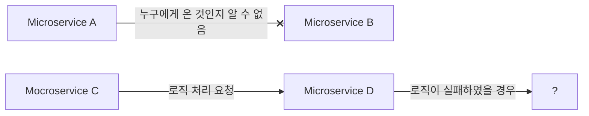

이러한 문제를 해결하기 위한 방법 중 하나는 오케스트레이션(orchestration)이 있습니다. 오케스트레이션은 은 MSA에서 서비스 간의 복잡한 상호작용과 워크플로우를 관리하는 하나의 방법입니다.

오케스트레이션은 **중앙 관리자가 전체 워크플로우를 관리하며, 모든 서비스의 상호작용을 제어하는 라우터의 역할을 수행합니다.**

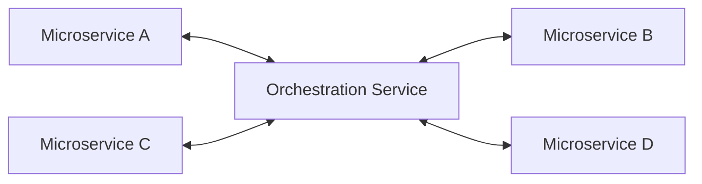

#### Orchestration: 좌석 예약

오케스트레이션을 통해 어떻게 좌석 예약을 수행하는지 알아보겠습니다.

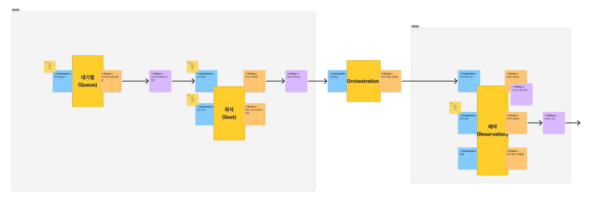

1. `좌석 서비스`가 예약을 받고, 이 정보를 `오케스트레이션 서비스`에 전달합니다.
2. `오케스트레이션 서비스`는 좌석 예약 이벤트를 수신한 후 `예약 서비스`에게 이벤트를 전달합니다.
3. 좌석 예약 이벤트를 수신한 `예약 서비스`는 예약 정보를 생성합니다.

만약, `예약 서비스`가 예약 정보 생성에 실패하면 어떻게 될까요?

1. 예약 정보 생성에 실패한 `예약 서비스`는 `오케스트레이션 서비스`에 예약 실패에 대한 이벤트를 발행합니다.
2. 예약 실패 이벤트를 수신한 `오케스트레이션 서비스`는 `좌석 서비스`에게 이 이벤트를 전달합니다.
3. `오케스트레이션 서비스`로 부터 예약 실패 이벤트를 수신한 `좌석 서비스`는 좌석 점유를 해제합니다.

#### Orchestration: 예약 결제

이번에는 예약 결제에 대한 워크플로우에 대해 알아보겠습니다.

1. `예약 서비스`가 결제 요청을 받고, `오케스트레이션 서비스`에 전달합니다.
2. `오케스트레이션 서비스`는 결제 이벤트를 `결제 서비스`에게 전달합니다.
3. 결제 이벤트를 수신한 `결제 서비스`는 결제를 로직을 수행합니다.
4. 만약, `결제 서비스`가 결제에 실패할 경우 `오케스트레이션 서비스`에게 결제 실패 이벤트를 전달합니다.
5. `오케스트레이션 서비스`가 결제 실패 이벤트를 `예약 서비스`에게 전달합니다.
6. 결제 실패 이벤트를 수신한 `예약 서비스`는 예약을 결제 실패 처리합니다.

 

## 2. Event Driven

이벤트를 통해 메인 로직에 집중할 수 있으며, 관심사를 분리할 수 있습니다.

이를 통해 비즈니스 로직의 트랜잭션 범위를 효과적으로 줄 일 수 있으며 이는 마이크로서비스로써의 확장을 쉽게 도와줍니다.

기존 레이어드 아키텍처의 구조는 다음과 같습니다.

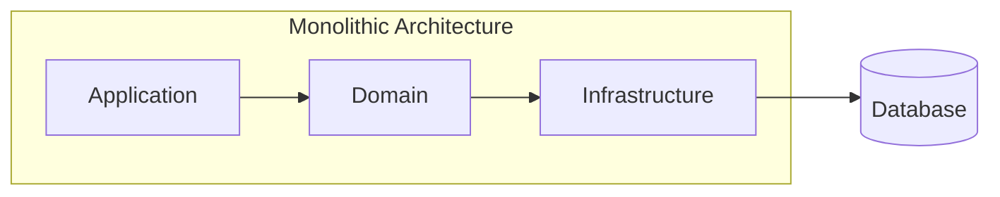

이벤트를 확장하기 위해서 다음 3가지 요소가 필요합니다.

- **Event**: 이벤트 발행 객체
- **Handler**: 이벤트 햄들러
- **Pool**: 이벤트 객체가 발행되면 응답해줄 핸들러를 관리

따라서 다음과 같이 이벤트를 발행할 수 있는 구조로 확장합니다.

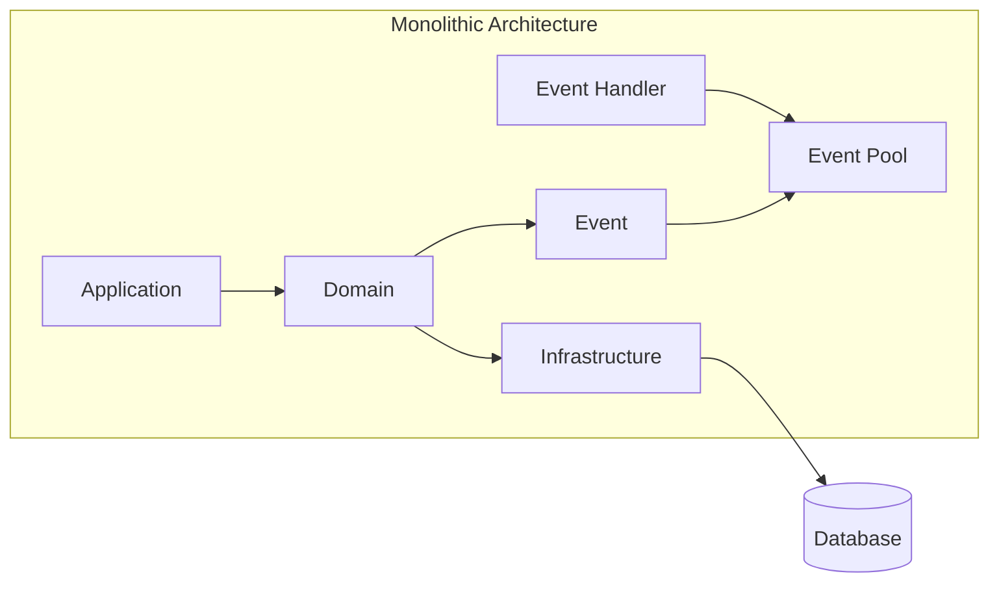

이벤트는 도메인 객체에서 발행됩니다.

발행된 이벤트는 이벤트 풀에 관리되며, 발행된 이벤트는 해당 이벤트 핸들러를 실행시킵니다.

> 이를 통해, 서로 분리되어 있는 도메인들이 이벤트를 통해 통신이 가능해집니다.

 

---

## References

- [추천팀의 DDD 도입기 | Kakao tech](https://tech.kakao.com/posts/555)
- [Event Storming | MSA School](https://www.msaschool.io/operation/design/design-three/)