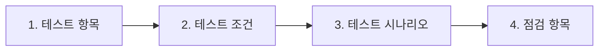
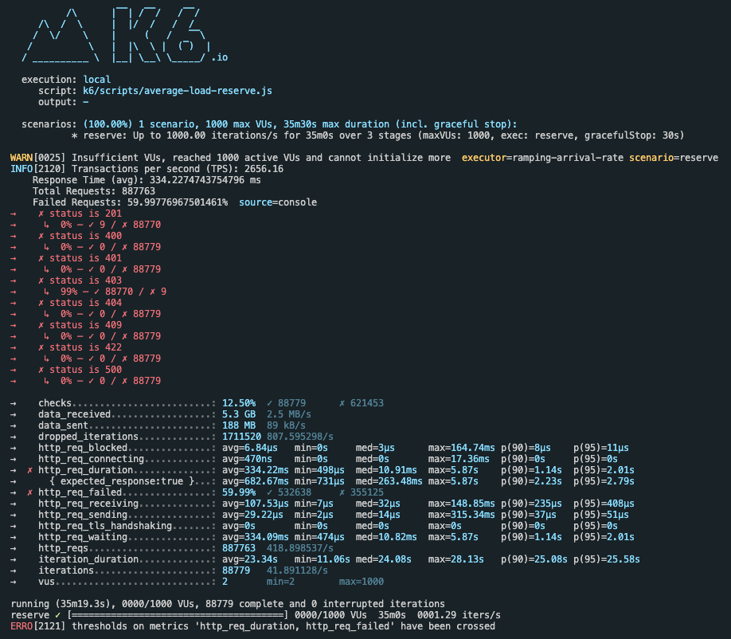
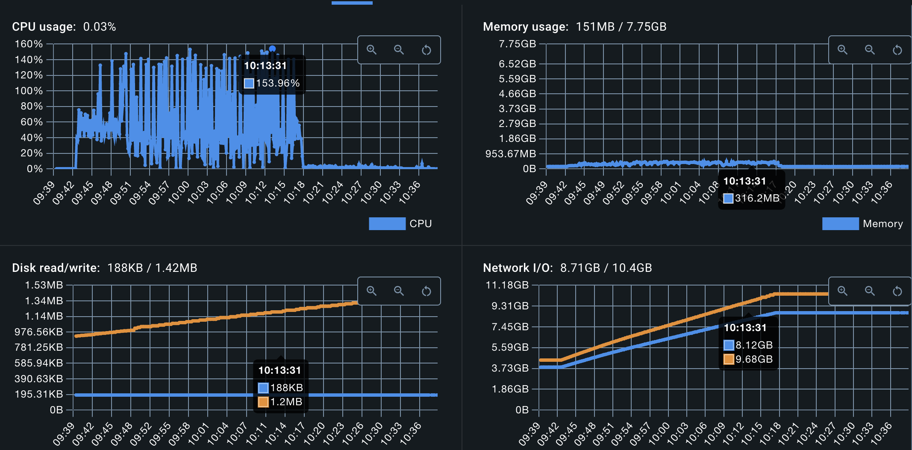
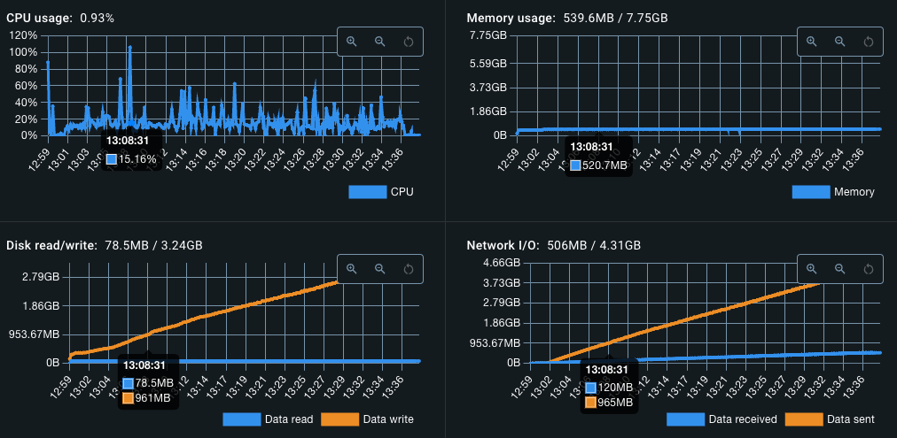
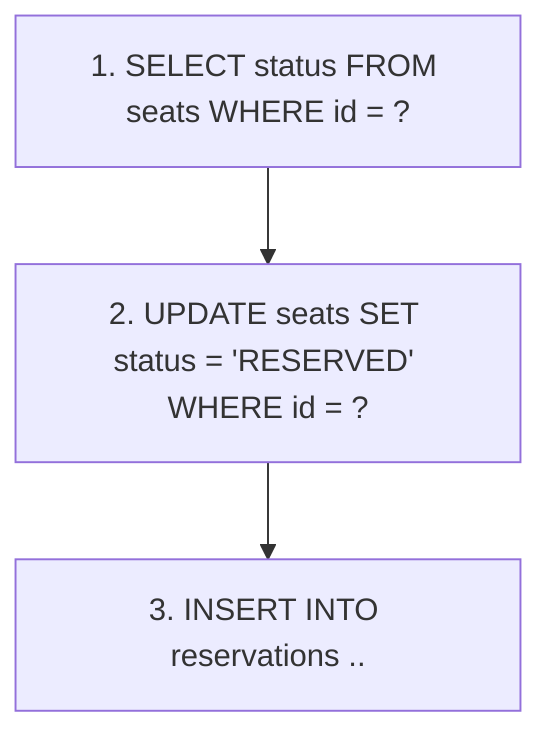
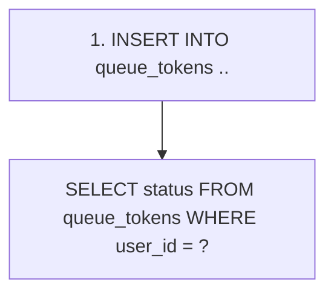
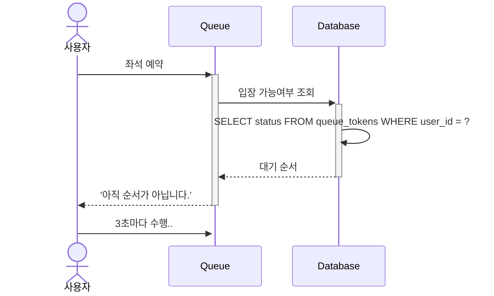
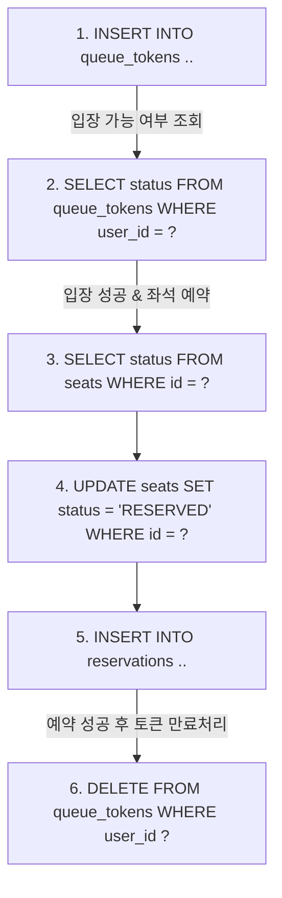
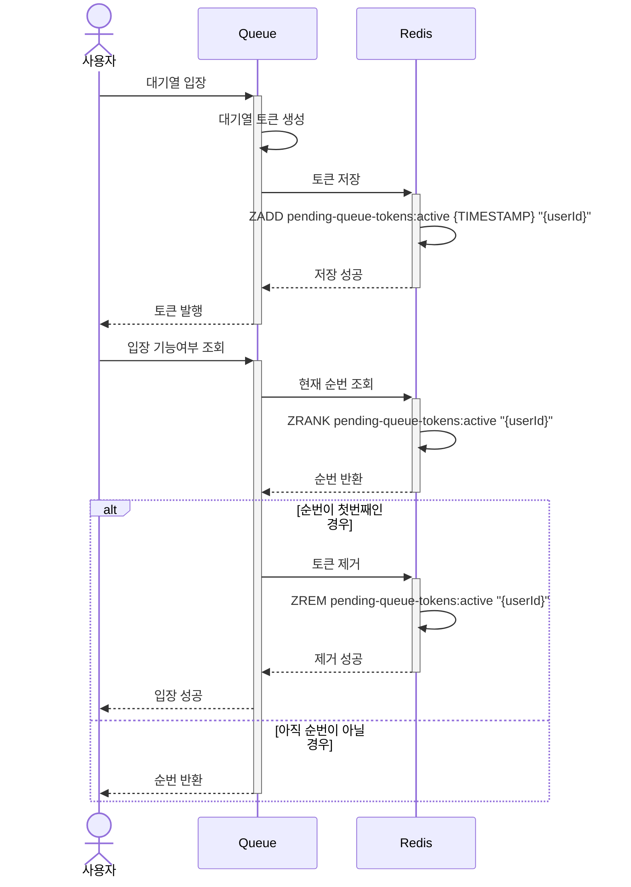

# 성능 개선

콘서트 예약 서비스에서 성능을 개선할 수 있는 로직을 분석하고, 개선 방안에 대한 자료를 정리합니다.

## 목차

1.  성능 테스트
2.  성능 분석
3.  개선 방안

<br />

## 1. 성능 테스트

일반적으로 성능 테스트는 '비기능적' 테스트를 말합니다. '기능' 테스트는 시스템이 정상적으로 작동하는지 확인하는 반면, 비기능 테스트는 시스템의 수요가 증가해도 정상적으로 작동하는지 확인하는 것을 말합니다.

시스템의 성능으로는 속도, 안정성, 확장성, 복구 가능성 등이 있습니다. 이러한 성능을 확인하는 방법이 있는데, 바로 부하 테스트(load testing)과 스트레스 테스트(stress testing) 입니다.

> [!NOTE] >**부하 테스트 vs 스트레스 테스트**
>
> 부하 테스트와 스트레스 테스트의 차이점은 시스템을 테스트하는 목적이 다르다는 것입니다.
> 부하 테스트는 예상 부하를 발생시켜 시스템이 정상적으로 동작하는지 확인합니다. 반면, 스트레스 테스트는 시스템이 버틸 수 있는 수준 이상에 부하를 발생시켰을 때, 시스템이 어떻게 망가지는지 확인하는 테스트입니다. 이를 통해, 최악의 상황을 대비하는 것이 스트레스 테스트의 주된 목적입니다.

이번 과제의 목표는 '성능 개선'입니다. 성능을 개선하기 위해서는 먼저 시스템이 예상하는 부하를 견딜 수 있는지를 확인해야 합니다. 따라서, 성능을 테스트하기 위해서는 '부하 테스트'가 적합하다고 판단되어 부하 테스트를 진행할 예정입니다.

### [1.1] 부하 테스트 진행

부하 테스트를 통해 알 수 있는 것은 '예상하는 부하를 발생시켰을 때, 과연 시스템이 버틸 수 있는가?' 입니다. 그 밖에 아래와 같은 것들을 알 수 있습니다.

- 예상 목표 TPS를 달성했는가?
- 피크 시간에서 원활하게 서비스 할 수 있는가?
- 문제가 발생했을 때, 어느 부분을 개선할 수 있는가?

부하 테스트 진행하기 위한 과정은 다음과 같습니다.



#### (1) 테스트 항목

> 테스트 항목은 테스트를 수행할 대상이 되는 모든 앱을 말합니다.

<table>
  <tr>
    <th>애플리케이션</th>
    <th>테스트 항목</th>
    <th>우선 순위</th>
  </tr>
  <tr>
    <td rowspan=5>콘서트 예약 서비스</td>
    <td>콘서트 · 일정 · 좌석 조회</td>
    <td>1</td>
  </tr>
  <tr>
    <td>좌석 예약</td>
    <td>1</td>
  </tr>
  <tr>
    <td>대기열</td>
    <td>2</td>
  </tr>
  <tr>
    <td>예약 결제</td>
    <td>2</td>
  </tr>
  <tr>
    <td>포인트 충전</td>
    <td>2</td>
  </tr>
</table>

#### (2) 테스트 조건

> 테스트를 수행할 모든 항목마다 만족해야할 조건을 설정합니다.

테스트는 Macbook pro Apple M1칩 환경에서 진행하였습니다.

앱과 DB는 다음과 같은 CPU와 메모리가 주어집니다.

- CPU: 2 Core
- Memory: 4GB

| 테스트 조건 | 설명                                                                                                                                  | 조건      |
| ----------- | ------------------------------------------------------------------------------------------------------------------------------------- | --------- |
| Ramp-up     | 목표로 하는 부하를 발생시키기 위한 웜업 단계입니다. 전체 테스트 시간에 5~15%를 차지합니다.                                            | 5분 지속  |
| Core-time   | 목표로 설정한 사용자가 접속한 상태에서 일정 시간동안 트래픽을 유지합니다. 이 구간에서 전반적인 부하 테스트 성과를 평가할 수 있습니다. | 25분 지속 |
| Ramp-down   | 코어타임이 종료되면 유지되던 트래픽을 점진적으로 감소시킵니다.                                                                        | 5분 지속  |

#### (3) 테스트 시나리오

> 시스템이 실제 운영 환경에서 어떻게 사용되는지를 모방하여 테스트를 수행하는 과정입니다.

```
사용자 시나리오

1. 콘서트 조회
2. 일정 조회
3. 좌석 조회
4. 대기열 토큰 발행
5. 매초마다 입장 가능여부 조회 (polling)
6. 좌석 예약 (200명까지만 예약 가능)
```

<table>
  <tr>
    <th>Application</th>
    <th>Target</th>
    <th>User</th>
    <th>Response Time(s)</th>
    <th>Think Time(s)</th>
    <th>TPS</th>
  </tr>
  <tr>
    <td rowspan=5>콘서트 예약 서비스</td>
    <td>콘서트 · 일정 · 좌석 조회</td>
    <td>1k</td>
    <td>0.5s</td>
    <td>4s</td>
    <td>200</td>
  </tr>
  <tr>
    <td>좌석 예약</td>
    <td>1k</td>
    <td>1s</td>
    <td>5s</td>
    <td>160</td>
  </tr>
  <tr>
    <td>예약 결제</td>
    <td>0.2k</td>
    <td>1s</td>
    <td>1s</td>
    <td>100</td>
  </tr>
  <tr>
    <td>포인트 충전</td>
    <td>0.2k</td>
    <td>1s</td>
    <td>1s</td>
    <td>100</td>
  </tr>
</table>

#### (4) 점검 항목

| 점검 항목                 | 설명                                                                  | 목표     |
| ------------------------- | --------------------------------------------------------------------- | -------- |
| CPU Utilization           | 코어타임에 CPU 사용률입니다.                                          | 70% 유지 |
| Memory                    | 코어타임에 메모리 사용률을 나타냅니다.                                | 70% 유지 |
| Disk read/write           | 코어타임에 사용되는 디스크 read/write에 대한 사용량을 나타냅니다.     | 70% 유지 |
| HTTP Request Success Rate | 전체 테스트를 진행하면서 달성해야 할 정상적인 응답율입니다.           | 99% 달성 |
| Response Time             | 사용자가 요청을 보낸 시점부터 응답을 받기까지 걸리는 전체 시간입니다. | 1초 이내 |

<br />
<br />

## 2. 성능 분석

테스트 조건에 따른 평균 부하 테스트를 진행하였습니다.

### [2.1] 부하 테스트 결과

테스트 시나리오와 조건에 따라 다음과 같은 결과를 도출하였습니다.



> 좌석 예약 시나리오의 테스트 결과

#### 측정 결과표

<table>
  <tr>
    <th>애플리케이션</th>
    <th>유즈케이스</th>
    <th>점검 항목</th>
    <th>결과</th>
  </tr>
  <tr>
    <td rowspan=5>좌석 예약 서비스</td>
    <td rowspan=5>좌석 예약</td>
    <td>TPS</td>
    <td>2,656</td>
  </tr>
  <tr>
    <td>Total Requests</td>
    <td>88,779</td>
  </tr>
  <tr>
    <td>Request Failed</td>
    <td>59,99%</td>
  </tr>
  <tr>
    <td>Average Request Time</td>
    <td>0.33s</td>
  </tr>
  <tr>
    <td>Maximum Request Time</td>
    <td>5.87s</td>
  </tr>
</table>

### [2.2] 리소스 사용률

> 리소스 사용률은 앱(Nest.js)와 데이터베이스(MySQL) 두 개의 도커 컨테이너에서 확인하였습니다.

성능 측정 결과 다음과 같은 사실을 알 수 있었습니다.

- CPU 사용률은 DB보다 앱이 더 높았습니다. (1.5개의 코어 수를 사용)
- DB는 1개 이상의 CPU 코어 수를 사용하였습니다.
- 당연한 결과지만 디스크와 메모리 리소스는 대부분 DB에서 사용되었습니다.
- 앱과 DB 두 곳에서 상당히 높은 네트워크 입출력이 확인되었습니다.
- 이는 대량의 데이터 조회나 업데이트가 빈번히 일어난 경우 이런 결과가 나타날 수 있습니다.

#### Nest.js

CPU 사용률이 153%로 나오는 이유는



- **CPU usage**: _153%_[^1]
- **Memoery usage**: _312MB_
- **Disk read/write**: _188KB/1.99MB_
- **Network I/O**: _8.71GB/10.4GB_

[^1]: Docker에서 CPU 사용률이 100% 이상이 나오는 이유는 코어 수에 비례하여 비율이 매겨지기 때문입니다. 예를 들어, 부하 테스트를 진행한 앱의 코어 수는 2개로, 코어 2개의 최대 사용률은 200%입니다. 즉, CPU 사용률이 153%라면 1.5개의 이상의 코어를 사용하고 있다는 뜻입니다. ([출처](https://dev.tigergraph.com/forum/t/tigergraph-docker-container-always-shows-cpu-utilization-between-150-600/3688/2))

#### MySQL



- **CPU usage**: _106%_
- **Memoery usage**: _598.5MB_
- **Disk read/write**:_79MB/3.24GB_
- **Network I/O**: _506MB/4.31GB_

### [2.3] 종합 분석

앱과 DB 모두 CPU 사용량이 높고 네트워크 I/O가 큰 것을 확인할 수 있었습니다. 이는 서비스가 고부하 상황에서 데이터 처리와 네트워크 통신을 요하고 있으며, 특히 DB와의 연동이 빈번하게 이루어지고 있음을 의미합니다.

앱의 경우, 높은 CPU 사용량은 처리 로직이 복잡하거나 비동기 작업이 많은 상황을 반영할 수 있습니다.

DB의 높은 디스크 읽기/쓰기와 네트워크 입출력은 상당한 부하가 걸려 있음을 나타냅니다. 특히 디스크 쓰기가 많다는 것은 대규모 트랜잭션이나 데이터 변경 작업이 빈번함을 나타내며, 이는 성능 병목으로 작용할 수 있습니다.

<br />
<br />

## 3. 개선 방안

분석 결과 DB는 높은 디스크 읽기/쓰기에 대한 부하가 걸려있음을 알 수 있습니다. 이를 해결하기 위한 개선 방안을 찾기 위해 시나리오를 다시 확인해볼 필요가 있습니다.

```text
테스트 시나리오

1. 콘서트 조회
2. 일정 조회
3. 좌석 조회
4. 대기열 토큰 발행
5. 매초마다 입장 가능여부 조회 (polling)
6. 좌석 예약
```

시나리오에서 알 수 있듯이 DB의 읽기/쓰기에 대한 성능을 요하는 유즈케이스는 '대기열 토큰 발행'과 '입장 가능여부 조회'입니다.

### [3.1] 개선 포인트

대기열 시스템은 대량의 트래픽이 발생했을 때 사용자를 순서대로 입장할 수 있도록 해주는 은행 창구와 같습니다.

현재 앱에서 대기열을 사용하는 유즈케이스는 **좌석 예약**입니다. 좌석 예약의 경우 DB에 높은 디스크 읽기/쓰기 성능을 요하고 있기 때문에, 대기열을 통해 순차적으로 사용자를 입장시켜 DB에 높은 부하를 줄여주는 역할을 수행합니다.

대기열 시스템을 이해하기 위해 좌석 예약과 왜 대기열이 필요한지 알아보겠습니다. 좌석을 예약하기 위해서는 총 3번의 쿼리가 실행되어야 합니다.



예를 들어, 1분만에 1,000개의 좌석이 전부 소진된다면 어떻게 될까요? 한 번의 예약을 위해 3번의 쿼리가 실행되어야 합니다. 1분만에 1000건의 예약이 진행된다면 3,000번의 쿼리가 실행되어야 합니다.

대기열 시스템을 사용하면 대량의 트래픽이 발생했을 때 어느정도 부하를 분산할 수 있습니다. 대기열 토큰을 발행하고, 대기열 순서에 따른 입장을 통해 좌석 예약을 이용하게 한다면 1분을 지연시켜 부하를 분산시키는 원리입니다.

대기열을 통해 입장하기 위해서는 '토큰 발행' 후 '입장 가능 여부 조회'해야 합니다.



만약 좌석 예약이 대기열 입장을 통해 진행된다고 가정해 보겠습니다. 한 번에 입장 가능한 인원이 10명이고 좌석 예약을 하는데 걸리는 시간이 1분이라면, 대기열을 통해 순서대로 입장시켜 100분의 시간에 걸처 1,000개의 좌석을 모두 예약할 수 있습니다. 따라서, 단 시간에 발생하는 대량의 트래픽을 긴 시간에 걸쳐 처리할 수 있습니다.

### [3.2] 대기열의 문제점

하지만 대기열 시스템에는 문제가 있습니다. 현재 대기열 시스템은 MySQL에서 동작하기 때문에 DB에 가해지는 분산이 오히려 늘어날 수 있다는 것입니다.

만약, 사용자가 대기열에 입장하기 위해 브라우저에서 3초마다 폴링하여 입장 가능여부를 체크한다면 DB에 가해지는 부하가 오히려 늘어날 수 있습니다.



또한, 좌석 예약에 대한 쿼리 수행과 더불어 대기열에 대한 쿼리까지 추가적으로 수행해야 합니다.



>대기열 토큰 발행 후 좌석 예약이 진행되며, 예약이 완료되면 토큰을 만료시켜야 합니다. 따라서 좌석 예약 + 대기열에 대한 쿼리까지 추가적으로 수행되어야 합니다.

결국, DB에 가해지는 부하를 분산시키기 위해 대기열을 사용했지만, DB를 사용하는 대기열의 특성 때문에 DB에 부하가 더해지게 되었습니다.

### [3.3] Redis를 이용하여 문제 해결하기

DB에 가해지는 부하를 분산하기 위해, 기존 DB를 이용하는 대기열 시스템을 Redis로 변경할 필요가 있습니다.

대기열 시스템의 스토리지를 Redis로 이관하는 이유는 다음과 같습니다.

1. 다른 스토리지를 이용하여 DB에 가해지는 부하를 분산
2. In-Memory DB의 특성상 빠른 성능을 제공
3. 폴링으로 인한 조회 부하를 Key-Value 형태로 전환하여 조회에 대한 부하를 제거할 수 있음

#### Sequence Diagram



<br />
<br />

---

## Reference

- [Queue-It | Load testing vs. stress testing](https://queue-it.com/blog/load-vs-stress-testing/)
- [GrafanaLabs | Load testing examples](https://grafana.com/load-testing/load-testing-examples/)
- [unclebae | 성능 테스트 - K6 Tutorials](https://github.com/schooldevops/k6-tutorials/blob/main/UsingK6/99_K6_Seminar.md)
- [INFCON 2023 | 기적의 4일! Go-성능 선착순 예매 시스템 구현](https://www.youtube.com/watch?v=94d7VnN_tp4&t=280s)
