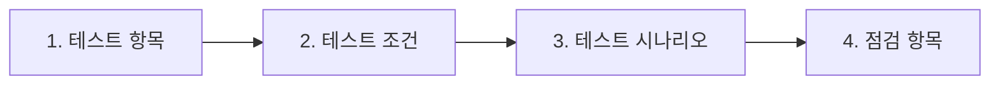

# 성능 개선

콘서트 예약 서비스에서 성능을 개선할 수 있는 로직을 분석하고, 개선 방안에 대한 자료를 정리합니다.

## 목차

1.  성능 테스트
2.  성능 분석
3.  개선 방안

<br />

## 1. 성능 테스트

일반적으로 성능 테스트는 '비기능적' 테스트를 말합니다. '기능' 테스트는 시스템이 정상적으로 작동하는지 확인하는 반면, 비기능 테스트는 시스템의 수요가 증가해도 정상적으로 작동하는지 확인하는 것을 말합니다.

시스템의 성능으로는 속도, 안정성, 확장성, 복구 가능성 등이 있습니다. 이러한 성능을 확인하는 방법이 있는데, 바로 부하 테스트(load testing)과 스트레스 테스트(stress testing) 입니다.

> [!NOTE] >**부하 테스트 vs 스트레스 테스트**
>
> 부하 테스트와 스트레스 테스트의 차이점은 시스템을 테스트하는 목적이 다르다는 것입니다.
> 부하 테스트는 예상 부하를 발생시켜 시스템이 정상적으로 동작하는지 확인합니다. 반면, 스트레스 테스트는 시스템이 버틸 수 있는 수준 이상에 부하를 발생시켰을 때, 시스템이 어떻게 망가지는지 확인하는 테스트입니다. 이를 통해, 최악의 상황을 대비하는 것이 스트레스 테스트의 주된 목적입니다.

이번 과제의 목표는 '성능 개선'입니다. 성능을 개선하기 위해서는 먼저 시스템이 예상하는 부하를 견딜 수 있는지를 확인해야 합니다. 따라서, 성능을 테스트하기 위해서는 '부하 테스트'가 적합하다고 판단되어 부하 테스트를 진행할 예정입니다.

### [1.1] 부하 테스트 진행

부하 테스트를 통해 알 수 있는 것은 '예상하는 부하를 발생시켰을 때, 과연 시스템이 버틸 수 있는가?' 입니다. 그 밖에 아래와 같은 것들을 알 수 있습니다.

- 예상 목표 TPS를 달성했는가?
- 피크 시간에서 원활하게 서비스 할 수 있는가?
- 문제가 발생했을 때, 어느 부분을 개선할 수 있는가?

부하 테스트 진행하기 위한 과정은 다음과 같습니다.



#### (1) 테스트 항목

> 테스트 항목은 테스트를 수행할 대상이 되는 모든 앱을 말합니다.

<table>
  <tr>
    <th>애플리케이션</th>
    <th>테스트 항목</th>
    <th>우선 순위</th>
  </tr>
  <tr>
    <td rowspan=5>콘서트 예약 서비스</td>
    <td>콘서트 · 일정 · 좌석 조회</td>
    <td>1</td>
  </tr>
  <tr>
    <td>좌석 예약</td>
    <td>1</td>
  </tr>
  <tr>
    <td>대기열</td>
    <td>2</td>
  </tr>
  <tr>
    <td>예약 결제</td>
    <td>2</td>
  </tr>
  <tr>
    <td>포인트 충전</td>
    <td>2</td>
  </tr>
</table>

#### (2) 테스트 조건

> 테스트를 수행할 모든 항목마다 만족해야할 조건을 설정합니다.

테스트 환경은 다음과 같습니다.

- CPU: Apple M1 (4 Core)
- Memory: 16GB

| 테스트 조건 | 설명                                                                                                                                  | 조건      |
| ----------- | ------------------------------------------------------------------------------------------------------------------------------------- | --------- |
| Ramp-up     | 목표로 하는 부하를 발생시키기 위한 웜업 단계입니다. 전체 테스트 시간에 5~15%를 차지합니다.                                            | 5분 지속  |
| Core-time   | 목표로 설정한 사용자가 접속한 상태에서 일정 시간동안 트래픽을 유지합니다. 이 구간에서 전반적인 부하 테스트 성과를 평가할 수 있습니다. | 35분 지속 |
| Ramp-down   | 코어타임이 종료되면 유지되던 트래픽을 점진적으로 감소시킵니다.                                                                        | 5분 지속  |

#### (3) 테스트 시나리오

> 시스템이 실제 운영 환경에서 어떻게 사용되는지를 모방하여 테스트를 수행하는 과정입니다.

```
사용자 시나리오

1. 콘서트 조회
2. 일정 조회
3. 좌석 조회
4. 포인트 충전
5. 대기열 토큰 발행
6. 매초마다 입장 가능여부 조회 (Polling)
7. 좌석 예약
8. 예약 결제
```

<table>
  <tr>
    <th>Application</th>
    <th>Target</th>
    <th>User</th>
    <th>Response Time(s)</th>
    <th>Think Time(s)</th>
    <th>TPS</th>
  </tr>
  <tr>
    <td rowspan=5>콘서트 예약 서비스</td>
    <td>콘서트 · 일정 · 좌석 조회</td>
    <td>1k</td>
    <td>0.5s</td>
    <td>4s</td>
    <td>200</td>
  </tr>
  <tr>
    <td>대기열</td>
    <td>1k</td>
    <td>0.5s</td>
    <td>0s</td>
    <td>2,000</td>
  </tr>
  <tr>
    <td>좌석 예약</td>
    <td>1k</td>
    <td>1s</td>
    <td>1s</td>
    <td>500</td>
  </tr>
  <tr>
    <td>예약 결제</td>
    <td>0.2k</td>
    <td>1s</td>
    <td>1s</td>
    <td>100</td>
  </tr>
  <tr>
    <td>포인트 충전</td>
    <td>0.2k</td>
    <td>1s</td>
    <td>1s</td>
    <td>100</td>
  </tr>
</table>

#### (4) 점검 항목

| 점검 항목                 | 설명                                                                  | 목표     |
| ------------------------- | --------------------------------------------------------------------- | -------- |
| CPU Utilization           | 코어타임에 CPU 사용률입니다.                                          | 70% 유지 |
| Memory                    | 코어타임에 메모리 사용률입니다.                                       | 70% 유지 |
| Disk I/O                  | 코어타임에 디스크 I/O 입니다.                                         | 70% 유지 |
| HTTP Request Success Rate | 전체 테스트를 진행하면서 달성해야 할 정상적인 응답율입니다.           | 99% 달성 |
| Response Time             | 사용자가 요청을 보낸 시점부터 응답을 받기까지 걸리는 전체 시간입니다. | 1초 이내 |

---

## Reference

- [GrafanaLabs | Load testing examples](https://grafana.com/load-testing/load-testing-examples/)
- [unclebae | 성능 테스트 - K6 Tutorials](https://github.com/schooldevops/k6-tutorials/blob/main/UsingK6/99_K6_Seminar.md)
- [INFCON 2023 | 기적의 4일! Go-성능 선착순 예매 시스템 구현](https://www.youtube.com/watch?v=94d7VnN_tp4&t=280s)
