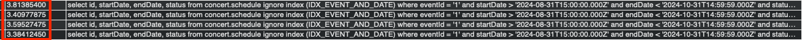

# 쿼리 성능 개선

## 조회 조건

- 1m ~ 10m(1,000,000 ~ 10,000,000)건의 콘서트, 스케줄, 좌석 데이터[^1]
- 쿼리 실행 시간이 100ms 이상의 쿼리만 체크합니다.

[^1]: <a href="#테스트-데이터-생성">테스트 데이터 생성</a> 섹션을 참고해주세요.

## 쿼리 수집

성능을 개선할 쿼리는 다음과 같습니다.

- 예약 가능한 스케줄 조회
- 예약 가능한 좌석 조회

## 성능 테스트 & 개선

### 스케줄 조회

콘서트의 스케줄을 조회하는 쿼리입니다.

```sql
SELECT id, eventId, startDate, endDate, status
FROM schedule
WHERE eventId = ?
  AND startDate > ?
  AND endDate < ?
```

스케줄 조회는 `eventId`, `startDate`, `endDate` 컬럼을 조건으로 조회가 이루어집니다.

기존 엔티티의 경우 `startDate`, `endDate` 컬럼만을 사용하기 때문에 조회 조건이 인덱스를 전혀 사용하고 있지 않았습니다.

```typescript
@Entity('schedule')
@Index(['startDate', 'endDate'])
export class ScheduleEntity {
  ...
}
```

따라서, 기존 복합 인덱스에서 다음과 같이 eventId를 추가하였습니다.

```typescript
@Entity('schedule')
// @Index(['startDate', 'endDate']) 기존 복합 인덱스는 startDate, endDate 였습니다.
@Index(['event', 'startDate', 'endDate']) // 조회 조건에 따라 복합 인덱스에 eventId를 추가하였습니다.
export class ScheduleEntity {
 ...
}
```

#### 개선 전

- 10m 건의 데이터
- 쿼리 실행 시간: _3.8s_




#### 복합 인덱스로 조회

- 10m 건의 데이터
- 쿼리 실행 시간: _23s_


위 쿼리의 복합 인덱스 구성은 (eventId, startDate, endDate)입니다.

해당 복합 인덱스로 조회할 때, 범위 값 `startDate < ? AND endDate > ?`을 조회 조건으로 사용하면 매우 느리게 동작하는 것을 확인했습니다.

자세한 내용은 <a href="#인덱스-성능이-느린-이유">"인덱스 성능이 느린 이유"</a> 섹션을 참고해주세요.

#### 커버링 인덱스 사용

- 10m 건의 데이터
- 쿼리 실행 시간: _3.9s_


다음과 같이 커버링 인덱스를 추가하고, 쿼리 튜닝을 진행하였습니다.

```typescript
@Entity('schedule')
// @Index(['startDate', 'endDate']) 기존 복합 인덱스는 startDate, endDate 였습니다.
// @Index(['event', 'startDate', 'endDate']) // 조회 조건에 따라 복합 인덱스에 eventId를 추가하였습니다.
@Index(['event', 'startDate', 'endDate', 'id']) // 커버링 인덱스를 사용하기 위해 ID 컬럼을 추가하였습니다.
export class ScheduleEntity {
  ...
}
```

인덱스 컬럼(`id`, `startDate`, `endDate`)만을 선택하여 쿼리 튜닝하였습니다.

```typescript
  async findBetweenByEventId(
    eventId: string,
    between: { startDate: LocalDateTime; endDate: LocalDateTime },
  ): Promise<Schedule[]> {
    // 기존 조회 로직입니다.
    // const entities = await this.dataSource.manager.find(ScheduleEntity, {
    //   where: {
    //     event: { id: eventId },
    //     startDate: MoreThanOrEqual(between.startDate),
    //     endDate: LessThanOrEqual(between.endDate),
    //   },
    // });

    // 다음과 같이 쿼리 튜닝을 진행하였습니다.
    const entities = await this.dataSource
      .createQueryBuilder(ScheduleEntity, 'schedule')
      .select(['id', 'startDate', 'endDate'])
      .where('schedule.eventId = :eventId', { eventId })
      .andWhere('schedule.startDate >= :startDate')
      .andWhere('schedule.endDate <= :endDate')
      .setParameters({
        eventId,
        startDate: between.startDate.toDate('Asia/Seoul'),
        endDate: between.endDate.toDate('Asia/Seoul'),
      })
      .getRawMany();
    return entities.map(ScheduleMapper.toModel);
  }
```

<br />

### 좌석 조회

기존 스케줄의 좌석을 조회하는 쿼리는 다음과 같습니다.

```sql
SELECT
  `SeatEntity`.`id` AS `SeatEntity_id`,
  `SeatEntity`.`eventId` AS `SeatEntity_eventId`,
  `SeatEntity`.`number` AS `SeatEntity_number`,
  `SeatEntity`.`status` AS `SeatEntity_status`,
  `SeatEntity`.`price` AS `SeatEntity_price`,
  `SeatEntity`.`version` AS `SeatEntity_version`,
  `SeatEntity`.`scheduleId` AS `SeatEntity_scheduleId`,
  `SeatEntity__SeatEntity_schedule`.`id` AS `SeatEntity__SeatEntity_schedule_id`,
  `SeatEntity__SeatEntity_schedule`.`startDate` AS `SeatEntity__SeatEntity_schedule_startDate`,
  `SeatEntity__SeatEntity_schedule`.`endDate` AS `SeatEntity__SeatEntity_schedule_endDate`,
  `SeatEntity__SeatEntity_schedule`.`eventId` AS `SeatEntity__SeatEntity_schedule_eventId`
FROM
  `seat` `SeatEntity`
  LEFT JOIN `schedule` `SeatEntity__SeatEntity_schedule` ON `SeatEntity__SeatEntity_schedule`.`id` = `SeatEntity`.`scheduleId`
WHERE
  (
    `SeatEntity__SeatEntity_schedule`.`id` = ?
    AND (`SeatEntity`.`status` = ?)
  ) -- PARAMETERS: ["1000001","PENDING"]
;
```

#### 개선 전

- 쿼리 수행 시간: _4,794ms_


#### 복합 인덱스 사용

- 쿼리 수행 시간: _1,922ms_


#### 쿼리 튜닝 #1: 필요한 컬럼만 Select

- 쿼리 수행 시간: _2,044ms_


아래와 같이 필요한 컬럼만을 조회하기 위해 쿼리 튜닝을 진행했지만, 성능적 차이는 발생하지 않았습니다. (오히려 로직에 관리 포인트만 들어남)

```typescript
async findAvailables(scheduleId: string): Promise<Seat[]> {
    // const entities = await this.dataSource.manager.findBy(SeatEntity, {
    //   schedule: { id: scheduleId },
    //   status: SeatStatus.Pending,
    // });

    const entities = await this.dataSource.manager
      .createQueryBuilder(SeatEntity, 'seat')
      .innerJoin('seat.schedule', 'schedule')
      .select([
        'seat.id as id',
        'seat.number as number',
        'seat.status as status',
        'seat.price as price',
        'seat.version as version',
        'seat.scheduleId as scheduleId',
        'schedule.startDate as scheduleStartDate',
        'schedule.endDate as scheduleEndDate',
      ])
      .where('schedule.id = :scheduleId')
      .andWhere('seat.status = :status')
      .setParameters({ scheduleId, status: SeatStatus.Pending })
      .getRawMany();
    return entities.map((raw) =>
      SeatMapper.toModel({
        id: raw.id,
        number: raw.number,
        status: raw.status,
        price: raw.price,
        version: raw.version,
        schedule: {
          id: raw.scheduleId,
          startDate: raw.scheduleStartDate,
          endDate: raw.scheduleEndDate,
        },
      } as any),
    );
  }
```

#### 쿼리 튜닝: 불필요한 Join 제거

- 쿼리 수행 시간: _1,690ms_


기존 로직에서 Schedule 엔티티에 대한 컬럼은 사용하고 있지 않기 때문에, 아래와 같이 기존 Seat 엔티티에서 Schedule을 Join하는 쿼리를 제거한 후 수행하였습니다.

```typescript
  async findAvailables(scheduleId: string): Promise<Seat[]> {
    const entities = await this.dataSource.manager.find(SeatEntity, {
      // loadEagerRelations 옵션을 false로 설정하면 Schedule 엔티티에 대한 Join을 수행하지 않습니다.
      loadEagerRelations: false,
      where: {
        scheduleId,
        status: SeatStatus.Pending,
      },
    });
    return entities.map(SeatMapper.toModel);
  }
```

<br />

## 결과 정리

- 테이블 풀 스캔 vs 커버링 인덱스를 비교해 보았을 때 성능적 차이가 거의 나지 않았습니다. (0.1~4s 차이)
- 복합 인덱스는 카디널리티가 높은 순[^2]으로 구성해야 효율이 가장 좋습니다.
- `startDate < ? and endDate > ?`와 같이 범위 연산자를 사용할 경우 인덱스를 타지 않고 테이블 풀 스캔을 하게 됩니다.
- `FORCE INDEX (IDX_?)`로 강제로 인덱스를 사용하게 하였습니다. 하지만 인덱스 성능은, 오히려 풀 스캔보다 좋지 못하였습니다.

<br />

---

<br />

## 인덱스 성능이 느린 이유


> 혹시 몰라서 쿼리를 조금 수정하여 테스트해보았습니다. (쿼리 실행 시간: 128s)

- **복합 인덱스를 사용하면**, MySQL은 인덱스를 통해 해당 레코드의 위치를 찾아내고, 그 위치에 해당하는 데이터를 실제 테이블에서 읽어옵니다. 이 과정은 일반적으로 랜덤 접근[^3]이 많이 발생하게 됩니다. 디스크에서 랜덤 접근이 많아지면, 디스크 I/O가 많이 발생하여 성능이 저하될 수 있습니다.

- **테이블 풀 스캔 시**, MySQL은 테이블을 연속적으로 읽어들입니다. 이 경우 디스크 I/O가 연속적으로 발생하여 순차 접근[^4]이 이루어지는데, 이 방식이 대량의 데이터를 처리할 때 훨씬 효율적일 수 있습니다. 디스크가 데이터를 연속적으로 읽어오는 속도가 훨씬 빠르기 때문에 전체 데이터 스캔이 예상보다 빠르게 완료될 수 있습니다.

### 결론

전체적인 데이터 양에 의해 인덱스 접근보다 테이블 풀 스캔이 더 효율적일 수 있다는 것을 알았습니다.

> [!TIP]
>
> 10,000,000건의 데이터에서 조회할 때, 인덱스를 사용하면, 인덱스로 지정된 컬럼들 이외에 컬럼들을 디스크에 직접 찾아야하기 때문에 랜덤 접근이 발생합니다. 랜덤 접근으로 인해 디스크 헤더가 물리적으로 이동해야 하며, 이러한 과정이 여러번 발생하면 디스크 I/O의 오버헤드가 발생합니다.

이러한 문제들을 해결하기 위한 제가 생각하는 방법들입니다.

- Covering Index로 랜덤 접근 자체를 없앤다.
- 테이블 풀 스캔으로 디스크가 연속 접근할 수 있도록 유도한다.

[^2]: 카디널리티가 높을수록 유니크한 값입니다.

[^3]: 디스크의 여러 위치에 흩어져 있는 데이터를 비연속적으로 읽는 방식입니다. 예를 들어, 데이터베이스가 특정 인덱스를 참조하여 여러 개의 서로 다른 위치에 있는 데이터를 읽어와야 할 때 발생합니다.

[^4]: 디스크에서 데이터를 연속적으로 읽는 방식입니다. 이 경우, 데이터가 디스크 상에서 물리적으로 연속된 위치에 저장되어 있어, 디스크 헤드가 한 번의 이동만으로 데이터를 연속적으로 읽을 수 있습니다.

---

<br />

## Reference

- [커버링 인덱스](https://jojoldu.tistory.com/476)
- [MySQL 조회, index냐 Full Scan이냐](https://m.blog.naver.com/varkiry05/221817938210)
- [MySQL Index Hints](https://dev.mysql.com/doc/refman/8.4/en/index-hints.html)

### 테스트 데이터 생성

1m건의 데이터를 생성하는 쿼리입니다.

```sql
-- 콘서트 데이터 생성
INSERT INTO concert.event (id, title, address, startDate, endDate, createdDate, updatedDate)
SELECT
    a.id,
    CONCAT('Title ', a.id),  -- 'Title 1', 'Title 2', ..., 'Title 100000'
    'test',
    NOW() + INTERVAL (a.id % 365) DAY,  -- 현재 날짜에 임의의 날짜 추가
    NOW() + INTERVAL ((a.id % 365) + 1) DAY,  -- startDate 다음 날을 endDate로 지정
    NOW(),  -- 현재 날짜 및 시간
    NOW()  -- 현재 날짜 및 시간
FROM (
    SELECT @rownum := @rownum + 1 AS id
    FROM
    (SELECT 0 UNION ALL SELECT 1 UNION ALL SELECT 2 UNION ALL SELECT 3 UNION ALL SELECT 4
     UNION ALL SELECT 5 UNION ALL SELECT 6 UNION ALL SELECT 7 UNION ALL SELECT 8 UNION ALL SELECT 9) t1,
    (SELECT 0 UNION ALL SELECT 1 UNION ALL SELECT 2 UNION ALL SELECT 3 UNION ALL SELECT 4
     UNION ALL SELECT 5 UNION ALL SELECT 6 UNION ALL SELECT 7 UNION ALL SELECT 8 UNION ALL SELECT 9) t2,
    (SELECT 0 UNION ALL SELECT 1 UNION ALL SELECT 2 UNION ALL SELECT 3 UNION ALL SELECT 4
     UNION ALL SELECT 5 UNION ALL SELECT 6 UNION ALL SELECT 7 UNION ALL SELECT 8 UNION ALL SELECT 9) t3,
    (SELECT 0 UNION ALL SELECT 1 UNION ALL SELECT 2 UNION ALL SELECT 3 UNION ALL SELECT 4
     UNION ALL SELECT 5 UNION ALL SELECT 6 UNION ALL SELECT 7 UNION ALL SELECT 8 UNION ALL SELECT 9) t4,
    (SELECT 0 UNION ALL SELECT 1 UNION ALL SELECT 2 UNION ALL SELECT 3 UNION ALL SELECT 4
     UNION ALL SELECT 5 UNION ALL SELECT 6 UNION ALL SELECT 7 UNION ALL SELECT 8 UNION ALL SELECT 9) t5,
     (SELECT 0 UNION ALL SELECT 1 UNION ALL SELECT 2 UNION ALL SELECT 3 UNION ALL SELECT 4
     UNION ALL SELECT 5 UNION ALL SELECT 6 UNION ALL SELECT 7 UNION ALL SELECT 8 UNION ALL SELECT 9) t6,
    (SELECT @rownum := 0) r
) a
WHERE a.id <= 1000000;

-- 스케줄 데이터 생성
INSERT INTO concert.schedule (id, startDate, endDate, eventId)
SELECT
    @rownum := @rownum + 1 AS id,
    NOW() + INTERVAL (a.id % 365) DAY,  -- 현재 날짜에 임의의 날짜 추가
    NOW() + INTERVAL ((a.id % 365) + 1) DAY,  -- startDate 다음 날을 endDate로 지정
    '1'  -- large_data의 id를 eventId로 사용
FROM (
    SELECT @rownum := @rownum + 1 AS id
    FROM
    (SELECT 0 UNION ALL SELECT 1 UNION ALL SELECT 2 UNION ALL SELECT 3 UNION ALL SELECT 4
     UNION ALL SELECT 5 UNION ALL SELECT 6 UNION ALL SELECT 7 UNION ALL SELECT 8 UNION ALL SELECT 9) t1,
    (SELECT 0 UNION ALL SELECT 1 UNION ALL SELECT 2 UNION ALL SELECT 3 UNION ALL SELECT 4
     UNION ALL SELECT 5 UNION ALL SELECT 6 UNION ALL SELECT 7 UNION ALL SELECT 8 UNION ALL SELECT 9) t2,
    (SELECT 0 UNION ALL SELECT 1 UNION ALL SELECT 2 UNION ALL SELECT 3 UNION ALL SELECT 4
     UNION ALL SELECT 5 UNION ALL SELECT 6 UNION ALL SELECT 7 UNION ALL SELECT 8 UNION ALL SELECT 9) t3,
    (SELECT 0 UNION ALL SELECT 1 UNION ALL SELECT 2 UNION ALL SELECT 3 UNION ALL SELECT 4
     UNION ALL SELECT 5 UNION ALL SELECT 6 UNION ALL SELECT 7 UNION ALL SELECT 8 UNION ALL SELECT 9) t4,
    (SELECT 0 UNION ALL SELECT 1 UNION ALL SELECT 2 UNION ALL SELECT 3 UNION ALL SELECT 4
     UNION ALL SELECT 5 UNION ALL SELECT 6 UNION ALL SELECT 7 UNION ALL SELECT 8 UNION ALL SELECT 9) t5,
     (SELECT 0 UNION ALL SELECT 1 UNION ALL SELECT 2 UNION ALL SELECT 3 UNION ALL SELECT 4
     UNION ALL SELECT 5 UNION ALL SELECT 6 UNION ALL SELECT 7 UNION ALL SELECT 8 UNION ALL SELECT 9) t6,
    (SELECT @rownum := 0) r
) a
WHERE a.id <= 1000000;

-- 좌석 데이터 생성
INSERT INTO concert.seat (id, number, status, scheduleId, eventId, price, version)
SELECT
    @rownum := @rownum + 1 AS id,
    @rownum AS number,
    'PENDING' AS status,
    '1000001' AS scheduleId,
    '1' AS eventId,
    ROUND((RAND() * 100) + 10, 2) AS price,
    1 AS version
FROM (
    SELECT @rownum := @rownum + 1 AS id
    FROM
    (SELECT 0 UNION ALL SELECT 1 UNION ALL SELECT 2 UNION ALL SELECT 3 UNION ALL SELECT 4
     UNION ALL SELECT 5 UNION ALL SELECT 6 UNION ALL SELECT 7 UNION ALL SELECT 8 UNION ALL SELECT 9) t1,
    (SELECT 0 UNION ALL SELECT 1 UNION ALL SELECT 2 UNION ALL SELECT 3 UNION ALL SELECT 4
     UNION ALL SELECT 5 UNION ALL SELECT 6 UNION ALL SELECT 7 UNION ALL SELECT 8 UNION ALL SELECT 9) t2,
    (SELECT 0 UNION ALL SELECT 1 UNION ALL SELECT 2 UNION ALL SELECT 3 UNION ALL SELECT 4
     UNION ALL SELECT 5 UNION ALL SELECT 6 UNION ALL SELECT 7 UNION ALL SELECT 8 UNION ALL SELECT 9) t3,
    (SELECT 0 UNION ALL SELECT 1 UNION ALL SELECT 2 UNION ALL SELECT 3 UNION ALL SELECT 4
     UNION ALL SELECT 5 UNION ALL SELECT 6 UNION ALL SELECT 7 UNION ALL SELECT 8 UNION ALL SELECT 9) t4,
    (SELECT 0 UNION ALL SELECT 1 UNION ALL SELECT 2 UNION ALL SELECT 3 UNION ALL SELECT 4
     UNION ALL SELECT 5 UNION ALL SELECT 6 UNION ALL SELECT 7 UNION ALL SELECT 8 UNION ALL SELECT 9) t5,
     (SELECT 0 UNION ALL SELECT 1 UNION ALL SELECT 2 UNION ALL SELECT 3 UNION ALL SELECT 4
     UNION ALL SELECT 5 UNION ALL SELECT 6 UNION ALL SELECT 7 UNION ALL SELECT 8 UNION ALL SELECT 9) t6,
    (SELECT @rownum := 0) r
) a
WHERE a.id <= 1000000;
```
