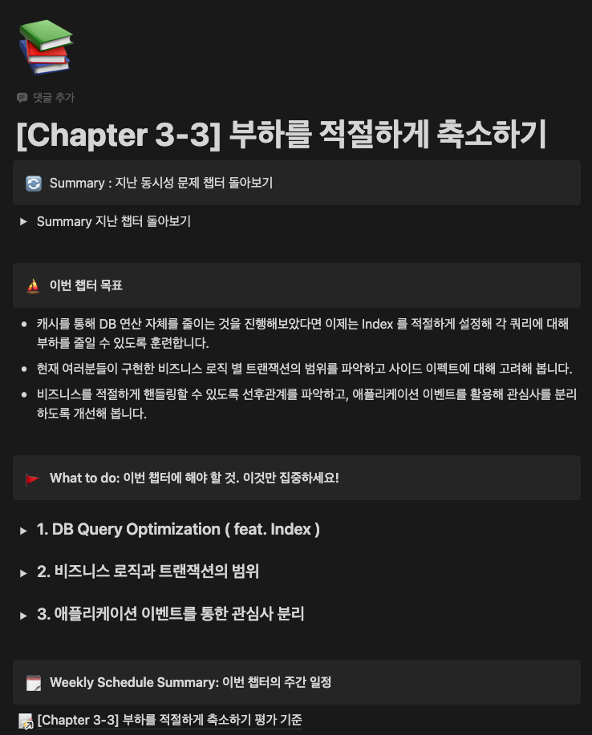
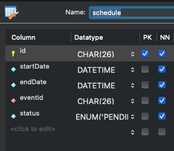
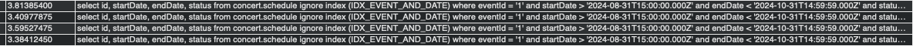
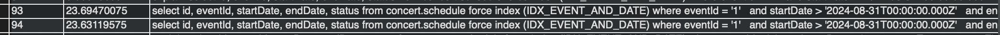
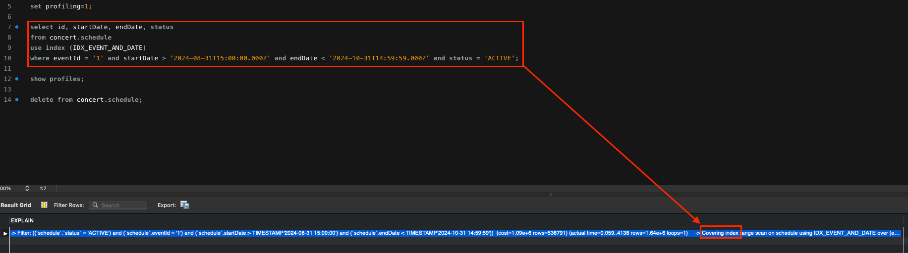
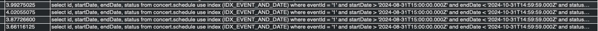

<!-- _class: lead -->

# 항해를 마치며

##### 10주간의 항해, 나는 얼마나 성장했을까?

###### 19조 이선주 <br />[boy672820@gmail.com][boy672820]

###### 

[boy672820]: https://github.com/boy672820

---

# 목차

1. 가장 기억에 남은 8주차: 부하 축소하기
2. Query Optimization을 통한 대용량 데이터 다루기[^#33]
3. Before & After
4. 마무리

[^#33]: https://github.com/boy672820/hhplus-server-concert/pull/33

---

# 1. 가장 기억에 남은 8주차

부하 축소하기

---

## 부하 축소하기

- `STEP 15` 쿼리 & 인덱스 튜닝을 통한 성능 개선 및 문서화
- `STEP 16` 트랜잭션 처리의 한계에 대한 해결방안 문서화 (MSA)

---

## STEP 15: Query Optimization (feat. Index)

가장 기억에 남은 8주차 스텝

`쿼리들을 수집하여 인덱스 적용 전·후를 비교해본다.`



---

# 2. Query Optimization

feat. Index

---

## 성능 개선: 공연 일정 조회

`시나리오: 콘서트 예약 서비스`

공연 일정을 조회하는 쿼리를 개선해 봅시다.



---

## 성능 개선: 공연 일정 조회

```sql
SELECT id, eventId, startDate, endDate, status
FROM schedule
WHERE eventId = ?
  AND startDate > ?
  AND endDate < ?
```

##### Full scan 결과

* 1,000만 건의 데이터 조회
* 쿼리 수행 시간: 3.8s
  

---

## 성능 개선: 공연 일정 조회

##### 인덱스를 적용해보자

```sql
CREATE INDEX idx_composite ON schedule(eventId, startDate, endDate);
```

##### 인덱스 성능은?

* 1,000만 건의 데이터 조회
* 쿼리 수행 시간: 23s
  
  * 오히려, 성능이 저하됨 (?)

---

## 성능 개선: 공연 일정 조회

##### 인덱스에 대해서 체크해봅시다.

인덱스는 테이블의 특정 열에 대해 빠른 검색을 가능하게 합니다. 그 이유는 B-트리(B-Tree)와 같은 자료 구조로 구현되어 있으며, 특정 키 값에 해당하는 레코드를 직접 찾아가 액세스할 수 있습니다.

<div class="mermaid">
flowchart LR
  subgraph Memoery
  Root --> Branch1 --> Leaf1
  Branch1 --> Leaf2
  Root --> Branch2
  end
  subgraph Disk
  Leaf1 --> Database([Table])
  end
</div>

> 인덱스 탐색은 _Root > Branch > Leaf > Disk_ 순으로 진행됩니다.

---

## 성능 개선: 공연 일정 조회

##### 인덱스에 대해서 체크해봅시다.

예를 들어,
`SELECT * FROM schedule WHERE eventId = 'abc';`와 같은 쿼리에서 eventId 열에 인덱스가 있다면 eventId가 "abc"인 레코드를 빠르게 찾을 수 있습니다.

<div class="mermaid">
flowchart LR
  subgraph Memoery
  Root --> Branch1 --인덱스로 조회됨--> Leaf1:::foo
  Branch1 --> Leaf2
  Root --> Branch2
  end
  subgraph Disk
  Leaf1 --> d([Table])
  end
  classDef foo stroke:#f00
</div>

---

## 성능 개선: 공연 일정 조회

##### 인덱스에 대해서 체크해봅시다.

이후 인덱스에 저장되어 있는 디스크 주소를 이용하여 실제 테이블에 접근합니다.

공연 일정 조회 쿼리의 경우, `eventid, startDate, endDate`를 제외한 나머지 `id, status` 컬럼을 가져와야 하기 때문에 디스크 I/O가 발생하게 됩니다.

<div class="mermaid">
erDiagram
  Node {
    string eventId
    datetime startDate
    datetime endDate
    pointer childPage
    pointer diskAddress
  }
</div>

<div class="mermaid">
flowchart LR
  subgraph Memoery
  Leaf1:::foo
  end
  subgraph Disk
  Leaf1 -- Random Access 발생 --> d([Table])
  end
  classDef foo stroke:#f00
</div>

---

## 성능 개선: 공연 일정 조회

##### 인덱스 고려사항

만약, 1,000만건의 데이터를 조회한다면 그 만큼 디스크 I/O가 자주 발생하게 됩니다.

디스크에서 데이터를 읽을 때, 데이터가 물리적으로 분산되어 있으면
(즉, 인덱스를 통해 위치를 찾아야 하는 경우)

디스크 헤드가 여러 위치로 이동하게 되어 성능 저하가 발생하게 됩니다.

<div class="mermaid">
flowchart LR
  subgraph Memoery
  Leaf1
  end
  subgraph Disk
  Leaf1 -- Random Access 발생 --> d([Table]):::foo
  end
  classDef foo stroke:#f00
</div>

---

## 성능 개선: 공연 일정 조회

##### 인덱스 사용이 불리한 경우:

* 다량의 레코드를 처리할 때는 랜덤 액세스가 디스크 I/O를 많이 발생시키므로 성능이 떨어질 수 있습니다.
* 즉, **디스크 저장소에 얼마나 덜 접근하게 만드느냐**에 달려있습니다.
  <div class="mermaid">
  flowchart LR
    subgraph Memoery
    Leaf1:::bar
    end
    subgraph Disk
    Leaf1 --x d([Table]):::foo
    end
    classDef bar stroke:#0f0
    classDef foo stroke:#f00
</div>

---

## 성능 개선: 공연 일정 조회

##### 해결 방법

1) 인덱스를 사용하지 않는다 (?)
2) Covering Index
3) 조회 조건 추가

---

## 성능 개선: 공연 일정 조회

##### Covering Index



##### 결과

* 1,000만 건의 데이터 조회
* 쿼리 수행 시간: 3.9s ---> ?????;;
  

---

## 성능 개선: 공연 일정 조회

##### 조회 조건 추가하기

기존 조회 조건 `eventId = ? AND startDate > ? AND endDate < ?`입니다.
여기서 `status = ?` 조건을 추가하여 최대한 범위 스캔(`startDate > ? AND endDate < ?`)할 데이터를 줄이는 것도 방법이겠지요.

```sql
CREATE INDEX idx_covering ON schedule(eventId, status, startDate, endDate, id);

SELECT id, eventId, status, startDate, endDate
FROM schedule
WHERE eventId = ?
  AND status = ?
  AND startDate > ?
  AND endDate < ?
```

---

# 3. Before & After

자가진단 및 평가

---

<!-- _class: self-diagnosis -->

## 자가진단표

<style>
  section.self-diagnosis table {
    color: black;
    font-size: 12px;
  }
  section.self-diagnosis .border.top.blue {
    border-top: 2px solid blue;
  }
  section.self-diagnosis .border.bottom.blue {
    border-bottom: 2px solid blue;
  }
  section.self-diagnosis .border.left.blue {
    border-left: 2px solid blue;
  }
  section.self-diagnosis .border.right.blue {
    border-right: 2px solid blue;
  }
  section.self-diagnosis .border.top.red {
    border-top: 2px solid red;
  }
  section.self-diagnosis .border.bottom.red {
    border-bottom: 2px solid red;
  }
  section.self-diagnosis .border.left.red {
    border-left: 2px solid red;
  }
  section.self-diagnosis .border.right.red {
    border-right: 2px solid red;
  }
</style>

<table>
  <thead>
    <tr>
      <th rowspan=2></th>
      <th rowspan=2>평가 항목</th>
      <th colspan=11>점수 (⚫️: 항해 전 / 🔴: 항해 후)</th>
    </tr>
    <tr>
      <th>0</th>
      <th>1</th>
      <th>2</th>
      <th>3</th>
      <th>4</th>
      <th>5</th>
      <th>6</th>
      <th>7</th>
      <th>8</th>
      <th>9</th>
      <th>10</th>
    </tr>
  </thead>
  <tbody>
    <tr>
      <td class="border top left blue">1</td>
      <td class="border top blue">TDD의 이해 및 테스트 코드 작성 능력</td>
      <td class="border top blue">⚪️</td>
      <td class="border top blue">⚪️</td>
      <td class="border top blue">⚪️</td>
      <td class="border top blue">⚫️</td>
      <td class="border top blue">⚪️</td>
      <td class="border top blue">⚪️</td>
      <td class="border top blue">🔴</td>
      <td class="border top blue">⚪️</td>
      <td class="border top blue">⚪️</td>
      <td class="border top blue">⚪️</td>
      <td class="border top right blue">⚪️</td>
    </tr>
    <tr>
      <td class="border bottom left blue">2</td>
      <td class="border bottom blue">레이어드 아키텍처 이해</td>
      <td class="border bottom blue">⚪️</td>
      <td class="border bottom blue">⚪️</td>
      <td class="border bottom blue">⚫️</td>
      <td class="border bottom blue">⚪️</td>
      <td class="border bottom blue">⚪️</td>
      <td class="border bottom blue">🔴</td>
      <td class="border bottom blue">⚪️</td>
      <td class="border bottom blue">⚪️</td>
      <td class="border bottom blue">⚪️</td>
      <td class="border bottom blue">⚪️</td>
      <td class="border bottom right blue">⚪️</td>
    </tr>
    <tr>
      <td>3</td>
      <td>Mileston/ERD/Spec/Sequence 등 문서 작성 능력</td>
      <td>⚪️</td>
      <td>⚪️</td>
      <td>⚪️</td>
      <td>⚪️</td>
      <td>⚪️</td>
      <td>⚫️</td>
      <td>🔴</td>
      <td>⚪️</td>
      <td>⚪️</td>
      <td>⚪️</td>
      <td>⚪️</td>
    </tr>
    <tr>
      <td>4</td>
      <td>Github Actions, ECR 등 CI/CD 구축 능력</td>
      <td>⚪️</td>
      <td>⚪️</td>
      <td>⚪️</td>
      <td>⚪️</td>
      <td>⚫️</td>
      <td>⚪️</td>
      <td>⚪️</td>
      <td>⚪️</td>
      <td>⚪️</td>
      <td>⚪️</td>
      <td>⚪️</td>
    </tr>
    <tr>
      <td>5</td>
      <td>비즈니스 로직을 이해하고 설계 및 구현하는 능력</td>
      <td>⚪️</td>
      <td>⚪️</td>
      <td>⚪️</td>
      <td>⚪️</td>
      <td>⚪️</td>
      <td>⚫️</td>
      <td>🔴</td>
      <td>⚪️</td>
      <td>⚪️</td>
      <td>⚪️</td>
      <td>⚪️</td>
    </tr>
    <tr>
      <td class="border top left blue">6</td>
      <td class="border top blue">예외 처리, 로깅 등 유효한 부가로직의 구현 능력</td>
      <td class="border top blue">⚪️</td>
      <td class="border top blue">⚪️</td>
      <td class="border top blue">⚫️</td>
      <td class="border top blue">⚪️</td>
      <td class="border top blue">🔴</td>
      <td class="border top blue">⚪️</td>
      <td class="border top blue">⚪️</td>
      <td class="border top blue">⚪️</td>
      <td class="border top blue">⚪️</td>
      <td class="border top blue">⚪️</td>
      <td class="border top right blue">⚪️</td>
    </tr>
    <tr>
      <td class="border left blue">7</td>
      <td>DB 동시성 제어 및 트랜잭션 처리 능력</td>
      <td>⚪️</td>
      <td>⚫️</td>
      <td>⚪️</td>
      <td>⚪️</td>
      <td>🔴</td>
      <td>⚪️</td>
      <td>⚪️</td>
      <td>⚪️</td>
      <td>⚪️</td>
      <td>⚪️</td>
      <td class="border right blue">⚪️</td>
    </tr>
    <tr>
      <td class="border left blue">8</td>
      <td>대량의 트래픽 처리를 위한 캐싱 및 비동기 처리 능력</td>
      <td>⚫️</td>
      <td>⚪️</td>
      <td>⚪️</td>
      <td>🔴</td>
      <td>⚪️</td>
      <td>⚪️</td>
      <td>⚪️</td>
      <td>⚪️</td>
      <td>⚪️</td>
      <td>⚪️</td>
      <td class="border right blue">⚪️</td>
    </tr>
    <tr>
      <td class="border bottom left blue">9</td>
      <td class="border bottom blue">성능 개선을 위한 인덱싱, 쿼리 최적화 능력</td>
      <td class="border bottom blue">⚪️</td>
      <td class="border bottom blue">⚫️</td>
      <td class="border bottom blue">⚪️</td>
      <td class="border bottom blue">⚪️</td>
      <td class="border bottom blue">🔴</td>
      <td class="border bottom blue">⚪️</td>
      <td class="border bottom blue">⚪️</td>
      <td class="border bottom blue">⚪️</td>
      <td class="border bottom blue">⚪️</td>
      <td class="border bottom blue">⚪️</td>
      <td class="border bottom right blue">⚪️</td>
    </tr>
    <tr>
      <td>
      <td>
      <td>
      <td>
      <td>
      <td>
      <td>
      <td>
      <td>
      <td>
      <td>
      <td>
      <td>
    </tr>
    <tr>
      <td class="border top left red">10</td>
      <td class="border top red">카프카를 이용한 서비스 확장 능력</td>
      <td class="border top red">⚫️</td>
      <td class="border top red">⚪️</td>
      <td class="border top red">🔴</td>
      <td class="border top red">⚪️</td>
      <td class="border top red">⚪️</td>
      <td class="border top red">⚪️</td>
      <td class="border top red">⚪️</td>
      <td class="border top red">⚪️</td>
      <td class="border top red">⚪️</td>
      <td class="border top red">⚪️</td>
      <td class="border top right red">⚪️</td>
    </tr>
    <tr>
      <td class="border left red">11</td>
      <td>부하 테스트 및 성능 분석 능력</td>
      <td>⚫️</td>
      <td>⚪️</td>
      <td>🔴</td>
      <td>⚪️</td>
      <td>⚪️</td>
      <td>⚪️</td>
      <td>⚪️</td>
      <td>⚪️</td>
      <td>⚪️</td>
      <td>⚪️</td>
      <td class="border right red">⚪️</td>
    </tr>
    <tr>
      <td class="border bottom left red">12</td>
      <td class="border bottom red">로깅 및 모니터링을 위한 도구 사용 능력</td>
      <td class="border bottom red">⚫️</td>
      <td class="border bottom red">🔴</td>
      <td class="border bottom red">⚪️</td>
      <td class="border bottom red">⚪️</td>
      <td class="border bottom red">⚪️</td>
      <td class="border bottom red">⚪️</td>
      <td class="border bottom red">⚪️</td>
      <td class="border bottom red">⚪️</td>
      <td class="border bottom red">⚪️</td>
      <td class="border bottom red">⚪️</td>
      <td class="border bottom right red">⚪️</td>
    </tr>
    <tr>
      <td></td>
      <td align=right>총합:</td>
      <th colspan=11>⚫️ 23 / 🔴 48</th>
    </tr>
  </tbody>
</table>

---

## 자가진단표

##### 🟦 발전을 이룬 항목
 
- 사전 스터디 진행
- 어느정도 기반이 다져진 지식

##### 🟥 아쉬운 항목

 - 컨디션 관리 실패
 - 접해보지 못한 기술 또는 지식
 - 문서 작성 능력 부족

---

## 목표 점검

##### 시작하는 마음 (1주차) [^post]

 * 10주간 모든 과제를 완료하기 (달성률: 90%)
 * 커뮤니티 적극 참여하기 (팀장했으니깐.. 50%?)

[^post]: https://velog.io/@boy672820/%EC%8B%9C%EC%9E%91%ED%95%98%EB%8A%94-%EB%A7%88%EC%9D%8C

---

## 종합 평가

ChatGPT 한테 물어봤습니다.

##### 목표 달성

* 주어진 과제를 성실히 수행하였으며, 지속적인 학습 태도와 시간 관리 능력이 뛰어났음을 보여줍니다.
* 단, 커뮤니티 참여는 상대적으로 낮은 편입니다. 팀장 역할을 수행하면서도 더 적극적으로 참여할 수 있는 여지가 있었다고 보입니다.

##### 결론

* 학습자는 10주간의 과정에서 상당한 기술적 성장을 이루었습니다.
  특히, TDD, 아키텍처 이해, 비즈니스 로직 설계 등의 영역에서 큰 발전을 보였습니다.
* 반면, 성능 최적화, 트랜잭션 관리, 대량 트래픽 처리 등의 고급 기술에서는 추가 학습이 필요합니다. 커뮤니티 참여도 개선의 여지가 있습니다.

---

# 4. 마무리

10주간의 항해를 마치며

---

## 정리

##### 기억에 남은 이슈

* 대량의 데이터를 조회할 때 인덱스를 사용하면 오히려 성능이 저하될 수 있음
  * (개선 방법: Covering Index, 최대한 적은 데이터를 불러오도록 status 등 조건 추가)

##### 얼마나 성장했는지

* TDD, 아키텍처 이해, 비즈니스 로직 설계 등의 영역에서 큰 발전을 보임

##### 아쉬운 점

* 성능 최적화, 대량 트래픽 처리 등의 추가 학습이 필요
* 커뮤니케이션에 있어서 적극적인 참여가 필요

---

## 항해를 마치며

10주 동안 혼자였다면 완주하지 못했을 것입니다.

다른 분들과의 소통을 통해 얻은 아이디어들이 저에게 큰 도움이 되었습니다.

항해를 마치며, 함께한 모든 분들이 앞으로도 건승하시길 바랍니다. 👏


<!-- mermaid.js -->
<script src="https://cdn.jsdelivr.net/npm/mermaid@10.9.1/dist/mermaid.min.js"></script>
<script>mermaid.initialize({startOnLoad:true});</script>
